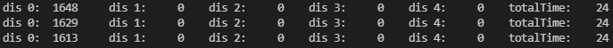
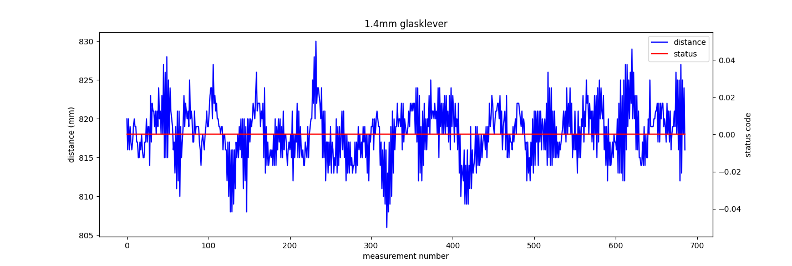
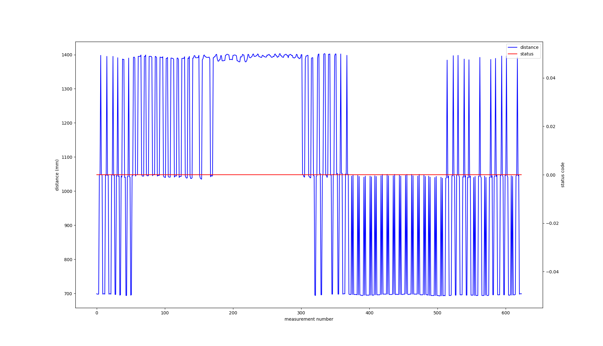
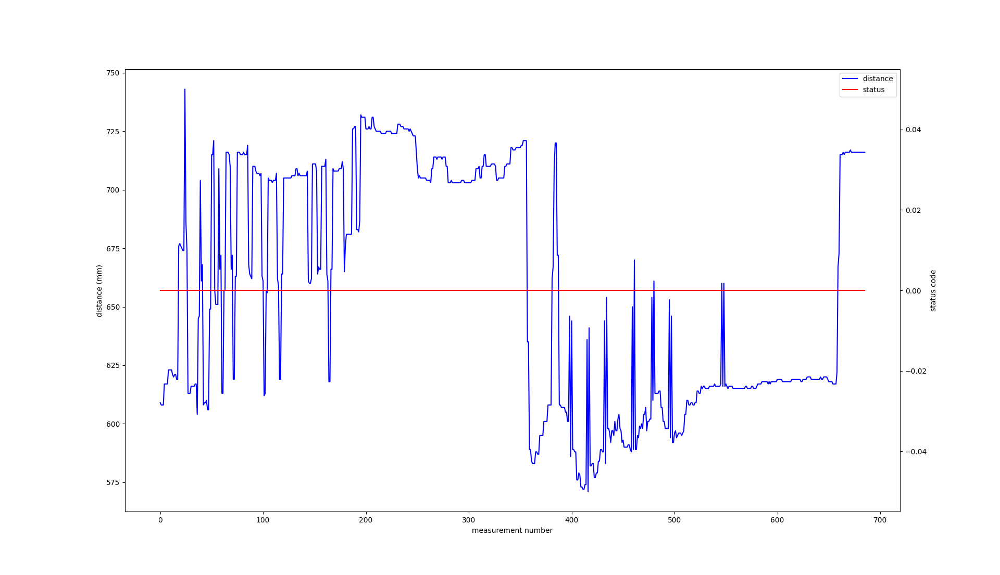
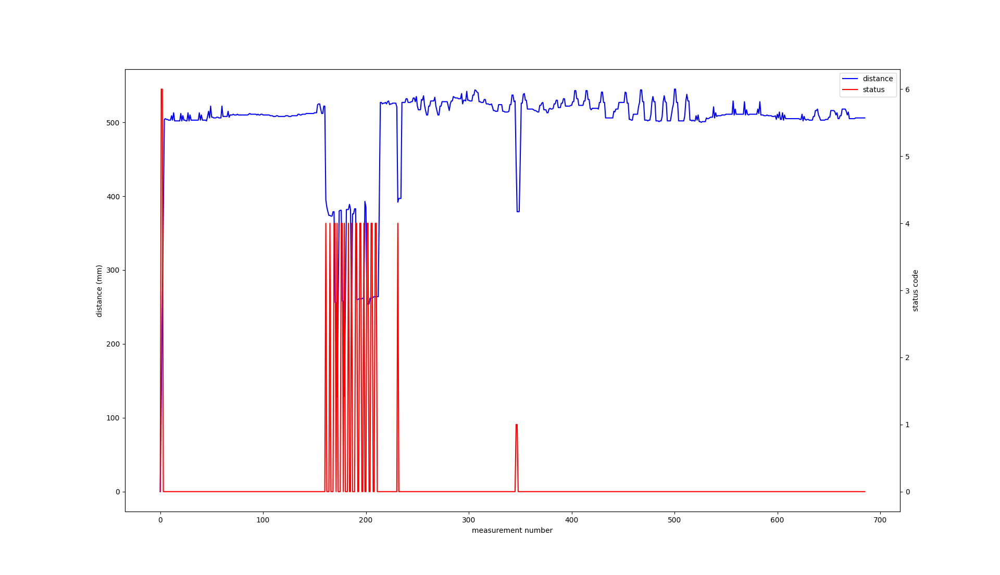
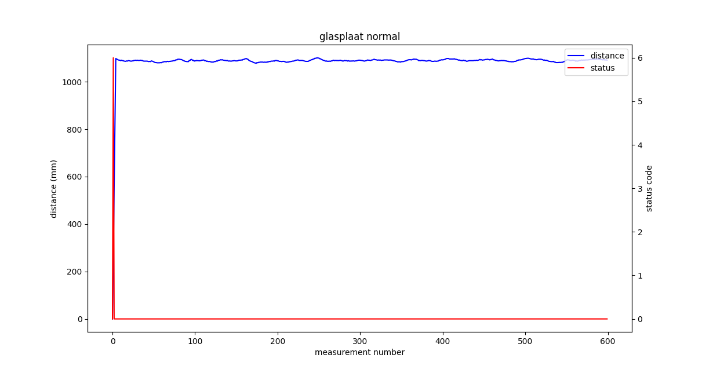
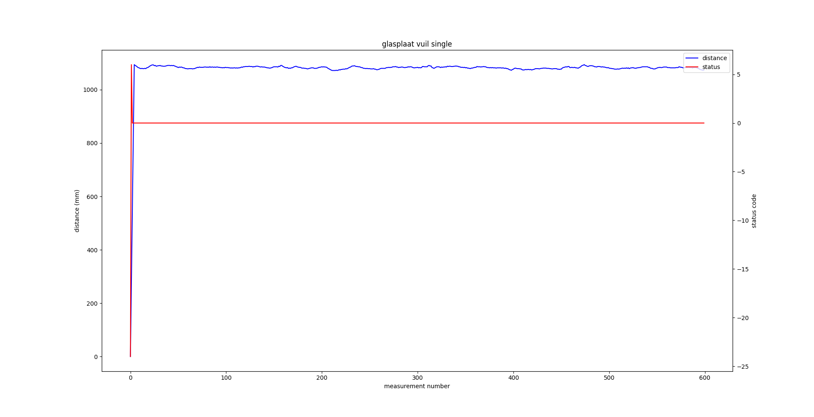

# Onderzoek

Dit markdown bestand bevat wat gegevens over onderzoeken die ik gaandeweg de analyse heb onderzocht.

Het zal bepaalde onderdelen staven waarom ik de desbetreffende zaken in het project heb gekozen.

----

# Inhoudsopgaven

- [Onderzoek](#onderzoek)
- [Inhoudsopgaven](#inhoudsopgaven)
- [Plaats Sensoren Development Kit](#plaats-sensoren-development-kit)
- [Snelheid Metingen Development Kit](#snelheid-metingen-development-kit)
  - [Eén sensor](#eén-sensor)
    - [BLOCKING_CONTINUOUS](#blocking_continuous)
    - [ASYNC_CONTINUOUS](#async_continuous)
  - [Vijf sensoren](#vijf-sensoren)
    - [BLOCKING_CONTINUOUS](#blocking_continuous-1)
    - [ASYNC_CONTINUOUS](#async_continuous-1)
- [Plaats Sensoren PCBV0.3](#plaats-sensoren-pcbv03)
  - [Kruislings](#kruislings)
  - [Piramide](#piramide)
  - [Trap](#trap)
- [Snelheid Metingen PCBV0.3](#snelheid-metingen-pcbv03)
- [Coverglas](#coverglas)
  - [plexiplaat](#plexiplaat)
  - [glasplaat](#glasplaat)
- [Smudge Detection plexiplaat](#smudge-detection-plexiplaat)
  - [Normale werking](#normale-werking)
  - [VL53LX_SMUDGE_CORRECTION_SINGLE](#vl53lx_smudge_correction_single)
  - [VL53LX_SMUDGE_CORRECTION_CONTINUOUS](#vl53lx_smudge_correction_continuous)
- [Smudge Detection glasplaat](#smudge-detection-glasplaat)
- [Trap in software verwerkt](#trap-in-software-verwerkt)
  - [Op papier](#op-papier)
  - [Met data](#met-data)
- [Bevindingen](#bevindingen)


----

# Plaats Sensoren Development Kit

Dit project is ontworpen om te reageren op bewegingen gegeven door een gebruiker. Omdat dit meestal een hand zal zijn, moet er gekeken worden hoe de sensoren juist t.o.v. elkaar moeten staan (kruis, ster, cirkel, ...).

Initieel starten we met een beweging dat van links naar rechts beweegt waarbij we 3 ToF-sensoren gebruiken. Deze kunnen we op enkelen manieren opstellen:

<div style="align:center">


</div>

Ik neem voorbeeld 1 omdat dit makkelijker is om een opstelling voor te maken. Voor s1 en s2 hebben we een afstand van 100mm (10cm) gekozen. Dit is ongeveer de breedte van mijn hand. Op deze manier zal 1 enkele sensor mijn hand zien wanneer ik deze ervoor breng en niet alle sensoren tegelijkertijd.

Als de gesture commando's uitgebreid worden, moeten we ook meerdere sensoren gebruiken om ze te kunnen detecteren. Hier hebben we ook enkele ideeën hoe we de sensoren kunnen plaatsen t.o.v. elkaar:


Uiteraard zijn dit niet de enige mogelijke opstellingen. Het is maar een idee hoe we ze kunnen plaatsen.

Wederom voor deze opstelling nemen we de simpelste opstelling dat een kruis voorstelt (1ste foto) met s1 en s2 op 100mm.

?> Wanneer de custom made PCB aankomt (PCBV0.3) kan er geëxperimenteerd worden met meer exotische opstellingen + afstanden.

Bij de gekregen Dev-kit is de genomen opstelling niet mogelijk zonder wat knip en plak werk. Daarom maken we een 3D geprinte opstelling waarop we de sensoren kunnen bevestigen.

<iframe src="https://myhub.autodesk360.com/ue2fad720/shares/public/SH9285eQTcf875d3c5394184e6c7b619f119?mode=embed" width="800" height="600" allowfullscreen="true" webkitallowfullscreen="true" mozallowfullscreen="true"  frameborder="0"></iframe>

Dat uiteindelijk uitkomt op dit:


De printplaat waarop de Nucleo-F401RE bevestigd is, wordt op een houten plaat bevestigd zodat deze verticaal staat. Op deze printplaat staan ook nog extra led's en drukknoppen om de analyse wat zichtbaar te maken.


# Snelheid Metingen Development Kit

!> De I2C klok frequentie is bij deze metingen ingesteld op 100kHz. Later wanneer PCBV0.3 onder handen wordt genomen, gaan we de klok frequentie proberen te verhogen naar 1MHz.

## Eén sensor

### BLOCKING_CONTINUOUS

!> De metingen die te zien zijn in de terminal screenshots zijn gebeurd zonder kalibratie van de sensor. Daarom dat deze afwijkend zijn van elkaar. De nauwkeurigheid van de sensor(en) heeft geen invloed op dit onderzoek.


Bij de gekregen Dev-kit werden de sensoren met mode *BLOCKING_CONTINUOUS* aangestuurd. Dit houd in dat de software zelf zal wachten totdat de sensor terug stuurt dat de data beschikbaar is. Dit proces herhalen we telkens.

<div style="display:inline-block; background-color:white">
<table style="background-color: white; color: black; display:inline;">
  <tr>
    <th></th>
    <th>min</th>
    <th>typ</th>
    <th>max</th>
    <th>eenheid</th>
  </tr>
  <tr>
    <td>TimingBudget</td>
    <td>500</td>
    <td>35</td>
    <td>16</td>
    <td>ms</td>
  </tr>
    <tr>
    <td>gemeten waarde software</td>
    <td>507</td>
    <td>43</td>
    <td>24</td>
    <td>ms</td>
  </tr>
</table>
</div>

terminal beelden

**minimaal**


**standaard**


**maximaal**



gebruikte code
``` C
 while (1)
      {
        timerTotal = HAL_GetTick();

        getResults(VL53L3A2_DEV_LEFT, Result);

        if ((HAL_GetTick() - timer) >= 2000)
        {
          int dis0 = Result[VL53L3A2_DEV_LEFT].ZoneResult[0].Distance[0];
          int dis1 = Result[VL53L3A2_DEV_CENTER].ZoneResult[0].Distance[0];
          int dis2 = Result[VL53L3A2_DEV_RIGHT].ZoneResult[0].Distance[0];
          int dis3 = Result[VL53L3A2_DEV_TOP].ZoneResult[0].Distance[0];
          int dis4 = Result[VL53L3A2_DEV_BOTTOM].ZoneResult[0].Distance[0];
          timer = HAL_GetTick();
          
          printf("dis 0: %5ld \t dis 1: %5ld \t dis 2: %5ld \t dis 3: %5ld \t dis 4: %5ld \t totalTime: %5d\r\n", dis0, dis1,dis2,dis3,dis4, prevTotalTime);
          prevTotalTime = 0;
        }
        totalTime = HAL_GetTick() - timerTotal;
        if(prevTotalTime < totalTime)
          prevTotalTime = totalTime;
        
        HAL_GPIO_TogglePin(L_Y_GPIO_Port, L_Y_Pin);
      }
```

### ASYNC_CONTINUOUS

Onderstaande metingen zijn uitgevoerd met LEFT sensor (1 sensor) die *ASYNC_CONTINUOUS* werkt. Dit gebeurd d.m.v. een interrupt waar we nadien de gegevens uitlezen en de flag resetten. 
Hier hebben we een maximale snelheid bereiken van 16ms.

<div style="display:inline-block; background-color:white">
<table style="background-color: white; color: black; display:inline;">
  <tr>
    <th></th>
    <th>min</th>
    <th>typ</th>
    <th>max</th>
    <th>eenheid</th>
  </tr>
  <tr>
    <td>TimingBudget</td>
    <td>500</td>
    <td>35</td>
    <td>16</td>
    <td>ms</td>
  </tr>
  <tr>
    <td>gemeten waarde software</td>
    <td>16</td>
    <td>16</td>
    <td>24</td>
    <td>ms</td>
  </tr>
  <tr>
    <td>gemeten waarde scoop </td>
    <td>494</td>
    <td>35</td>
    <td>16</td>
    <td>ms</td>
  </tr>
</table>
</div>

Scope beelden

**minimaal**


**standaard**


**maximaal**


De scoop beelden zeggen dat de tijd die de sensor op interrupt mode staat even lang blijft namelijk +-16ms ongeachte *TimingBudget*. De hoge periodes worden wel beïnvloed door *TimingBudget*. In de software daarentegen zijn de tijden wel korter dan bij *BLOCKING_CONTINUOUS*.

**minimaal**


**standaard**


**maximaal**


Uiteraard krijgen we pas een meeting binnen wanneer de sensor gereed is (een interrupt heeft gecreëerd) wat ook gevolgen heeft voor onze code. De snelheid van de code blijft wel op de 16ms~24ms ongeachte het *TimingBudget*.

code

``` C
while (1)
      {
        timerTotal = HAL_GetTick();

        checkSensorReady(isStarted0, isReady0, VL53L3A2_DEV_LEFT, Result);

        if ((HAL_GetTick() - timer) >= 2000)
        {
          int dis0 = Result[VL53L3A2_DEV_LEFT].ZoneResult[0].Distance[0];
          int dis1 = Result[VL53L3A2_DEV_CENTER].ZoneResult[0].Distance[0];
          int dis2 = Result[VL53L3A2_DEV_RIGHT].ZoneResult[0].Distance[0];
          int dis3 = Result[VL53L3A2_DEV_TOP].ZoneResult[0].Distance[0];
          int dis4 = Result[VL53L3A2_DEV_BOTTOM].ZoneResult[0].Distance[0];
          timer = HAL_GetTick();
          
          printf("dis 0: %5ld \t dis 1: %5ld \t dis 2: %5ld \t dis 3: %5ld \t dis 4: %5ld \t totalTime: %5d\r\n", dis0, dis1,dis2,dis3,dis4, prevTotalTime);
          prevTotalTime = 0;
        }
        totalTime = HAL_GetTick() - timerTotal;
        if(prevTotalTime < totalTime)
          prevTotalTime = totalTime;
        
        HAL_GPIO_TogglePin(L_Y_GPIO_Port, L_Y_Pin);
      }
```

Voor onze applicatie is snelheid van metingen belangrijk zodat de user hier geen hinder door vind.

## Vijf sensoren

Omdat ons systeem met 5 sensoren werkt zullen we dit ook even onderzoeken of dat we wel degelijk met interrupts de snelheid verhogen of niet. Idem als hierboven laten we eerst de terminal screenshots zien in modus *BLOCKING_CONTINUOUS* en nadien de modus *ASYNC_CONTINUOUS* die met interrupts werkt.

### BLOCKING_CONTINUOUS

<div style="display:inline-block; background-color:white">
<table style="background-color: white; color: black; display:inline;">
  <tr>
    <th></th>
    <th>min</th>
    <th>typ</th>
    <th>max</th>
    <th>eenheid</th>
  </tr>
  <tr>
    <td>TimingBudget</td>
    <td>500</td>
    <td>35</td>
    <td>16</td>
    <td>ms</td>
  </tr>
  <tr>
    <td>gemeten waarde software</td>
    <td>508</td>
    <td>86</td>
    <td>86</td>
    <td>ms</td>
  </tr>
</table>
</div>

**minimaal**


**standaard**


**maximaal**


code 

``` C
while (1)
      {
        timerTotal = HAL_GetTick();

        getResults(VL53L3A2_DEV_LEFT, Result);
        getResults(VL53L3A2_DEV_CENTER, Result);
        getResults(VL53L3A2_DEV_RIGHT, Result);
        getResults(VL53L3A2_DEV_TOP, Result);
        getResults(VL53L3A2_DEV_BOTTOM, Result);

        if ((HAL_GetTick() - timer) >= 2000)
        {
          int dis0 = Result[VL53L3A2_DEV_LEFT].ZoneResult[0].Distance[0];
          int dis1 = Result[VL53L3A2_DEV_CENTER].ZoneResult[0].Distance[0];
          int dis2 = Result[VL53L3A2_DEV_RIGHT].ZoneResult[0].Distance[0];
          int dis3 = Result[VL53L3A2_DEV_TOP].ZoneResult[0].Distance[0];
          int dis4 = Result[VL53L3A2_DEV_BOTTOM].ZoneResult[0].Distance[0];
          timer = HAL_GetTick();

          printf("dis 0: %5ld \t dis 1: %5ld \t dis 2: %5ld \t dis 3: %5ld \t dis 4: %5ld \t totalTime: %5d\r\n", dis0, dis1, dis2, dis3, dis4, prevTotalTime);
          prevTotalTime = 0;
        }
        totalTime = HAL_GetTick() - timerTotal;
        if (prevTotalTime < totalTime)
          prevTotalTime = totalTime;

        HAL_GPIO_TogglePin(L_Y_GPIO_Port, L_Y_Pin);
      }
```

### ASYNC_CONTINUOUS

<div style="display:inline-block; background-color:white">
<table style="background-color: white; color: black; display:inline;">
  <tr>
    <th></th>
    <th>min</th>
    <th>typ</th>
    <th>max</th>
    <th>eenheid</th>
  </tr>
  <tr>
    <td>TimingBudget</td>
    <td>500</td>
    <td>35</td>
    <td>16</td>
    <td>ms</td>
  </tr>
  <tr>
    <td>gemeten waarde software</td>
    <td>33</td>
    <td>86</td>
    <td>86</td>
    <td>ms</td>
  </tr>
</table>
</div>

**minimaal**


**standaard**


**maximaal**


code 

``` C
while (1)
      {
        timerTotal = HAL_GetTick();

        checkSensorReady(isStarted0, isReady0, VL53L3A2_DEV_LEFT, Result);
        checkSensorReady(isStarted1, isReady1, VL53L3A2_DEV_CENTER, Result);
        checkSensorReady(isStarted2, isReady2, VL53L3A2_DEV_RIGHT, Result);
        checkSensorReady(isStarted3, isReady3, VL53L3A2_DEV_TOP, Result);
        checkSensorReady(isStarted4, isReady4, VL53L3A2_DEV_BOTTOM, Result);

        if ((HAL_GetTick() - timer) >= 2000)
        {
          int dis0 = Result[VL53L3A2_DEV_LEFT].ZoneResult[0].Distance[0];
          int dis1 = Result[VL53L3A2_DEV_CENTER].ZoneResult[0].Distance[0];
          int dis2 = Result[VL53L3A2_DEV_RIGHT].ZoneResult[0].Distance[0];
          int dis3 = Result[VL53L3A2_DEV_TOP].ZoneResult[0].Distance[0];
          int dis4 = Result[VL53L3A2_DEV_BOTTOM].ZoneResult[0].Distance[0];
          timer = HAL_GetTick();

          printf("dis 0: %5ld \t dis 1: %5ld \t dis 2: %5ld \t dis 3: %5ld \t dis 4: %5ld \t totalTime: %5d\r\n", dis0, dis1, dis2, dis3, dis4, prevTotalTime);
          prevTotalTime = 0;
        }
        totalTime = HAL_GetTick() - timerTotal;
        if (prevTotalTime < totalTime)
          prevTotalTime = totalTime;

        HAL_GPIO_TogglePin(L_Y_GPIO_Port, L_Y_Pin);
      }
```

We kunnen concluderen dat snelheid niet het beste is wanneer we met meerdere sensoren werken. We gaan een balans moeten zoeken tussen de snelheid van het meten en de snelheid van verwerken.

We nemen hier 100 als waarde voor *TimingBudget* wat ons een software delay geeft van +-60ms.

# Plaats Sensoren PCBV0.3

## Kruislings


Zoals besproken in [Plaats Sensoren Development Kit](#plaats-sensoren-development-kit) zijn er enkele mogelijkheden om de sensoren op te stellen. We hebben daarom een plexi glas plaat ontworpen die genoeg mogelijkheden voorziet om de sensoren op verschillende plaatsen te bevestigen.

<iframe src="https://myhub.autodesk360.com/ue2fad720/shares/public/SH9285eQTcf875d3c5393429cd8315483a19?mode=embed" width="800" height="600" allowfullscreen="true" webkitallowfullscreen="true" mozallowfullscreen="true"  frameborder="0"></iframe>

Als eerste opstelling gaan we opteren om de sensoren kruislings te plaatsen. Dit omdat we met de development kit goede resultaten hebben bekomen. Later in dit hoofdstuk gaan we nog enkele opstellingen uitvoeren op werking.


We verplaatsen telkens de sensoren dichter en dichter totdat de metingen elkaar overlappen (het gaat vooral over de Up-Down & Down-Up gestures die door de handgrootte de links en rechtse sensor kunnen triggeren en omgekeerd).


De foto hierboven is de maximale afstand die de sensoren kunnen verdragen om geen foutieve metingen te triggeren. Dit is uiteraard enkel met mijn hand getest. mensen met een groter hand, kunnen hier nog wel last van hebben. Vandaar dat we de sensoren finaal met 1 plaats opschuiven naar de buitenkant zodat we hopelijk deze hand grootte kunnen inperken. De flat cables zijn nu wat aan de lange kant en gaan we in de toekomst wat kleiner maken.

De afstanden zijn nu:

* S1 = 6cm
* S2 = 6cm
* S3 = 10.5cm
* S4 = 6.5cm

Nu we weten dat de opstelling kruislings werkt, kunnen we eens verder zien naar mogelijke opstellingen die eventueel kunnen werken met minder sensoren in gebruik. Dit zal wel voor complexere code zorgen maar de snelheid, kost en grootte van de opstelling wordt wel optimaler.

## Piramide


Met bovenstaande opstelling is het theoretisch mogelijk om links, rechts, boven en onder te detecteren.

We lijsten even op hoe we zullen detecteren:

?> **LEGENDE** SR = sensor rechts, SC = sensor center, SL = sensor links

* **RECHTS-LINKS** --> SR -> SC -> SL
* **LINKS-RECHTS** --> SL -> SC -> SR
* **BOVEN-ONDER**  --> SC -> SR & SL
* **ONDER-BOVEN**  --> SR & SL -> SC

Het is belangrijk dat we bij de gestures boven-onder & onder-boven kijken of dat de 2 sensoren tezamen getriggerd zijn. Als we dit niet doen kan een iets schuinere onder boven een rechts-links (of links-rechts) gesture triggeren.

In de praktijk ziet de opstelling er zo uit:


Na het aanpassen van de code was het mogelijk om met de sensoren al de 4 gestures te verkrijgen. 


?> zie de [blueprint](https://github.com/RobbeElsermans/GestureControl/blob/main/docs/Documenten/Blueprint_V1.1_Robbe_Elsermans.pdf) (<a href="./Documenten/Blueprint_V1.1_Robbe_Elsermans.pdf" download>download</a>) voor meer informatie over de commando waardes.

De snelheid is ook aanzienlijk verbeterd en het RAM geheugen zit minder vol. Met deze opstelling kunnen we gebruik maken van de STM32F302RCT6 i.p.v. de STM32F302RET6.

Een nadeel met deze opstelling is dat wanneer we ons hand te schuin van boven naar onder (of onder naar boven) verplaatsen, we de links-rechts en rechts-links triggeren. Dit is een beetje gefilterd in de code door een gemiddelde te nemen over 5 metingen en nog wat extra flags om ervoor te zorgen dat wanneer de gesture controller denkt een bepaalde gesture binnen te krijgen, de andere gestures wat te negeren. uiteraard mag deze hold van andere gestures niet te lang duren. Vandaar dat er ook een reset timer is geplaatst die al de flags op 0 zet om de 0.5 seconden.

De afstanden zijn nu:

* S1 = 5cm
* S2 = 5cm
* S3 = 6cm
* S4 = 6cm

## Trap

Omdat ik nu toch bezig was met allerlei opstellingen dacht ik er ook aan om deze eens te proberen:


en in praktijk ziet dit er zo uit:


We lijsten even op hoe we zullen detecteren:

?> **LEGENDE** SR = sensor rechts, SC = sensor center, SL = sensor links

* **RECHTS-LINKS** --> SR -> SC -> SL
* **LINKS-RECHTS** --> SL -> SC -> SR
* **BOVEN-ONDER**  --> SC -> SR -> SL
* **ONDER-BOVEN**  --> SL -> SR -> SC

Als we opstelling [Piramide](#piramide) vergelijken met de trap opstelling, is te zien dat we in deze opstelling SR en SL apart kunnen monitoren voor de 4 toestanden. Dit is niet het geval bij de piramide (hier gebruiken we SR & SL bij 2 gestures tezamen).

Tijdens het testen van deze opstelling met gebruik makend van de sensor die op het main bordje zit, merkte ik op dat wanneer ik de boven-onder gesture uitoefende, dit niet altijd even vlot ging dan bij de andere 3 gestures. Ik heb daarom een sensor bordje in de plaats gezet i.p.v. het main bordje. We zullen nu dus ook de XSHUT van het main bord op "0" moeten zetten zodat de sensor niet gebruikt wordt.


Na het testen van de opstelling en geprobeerd een zo ideaal mogelijke schikking te vinden, is er ook weer een stuk plexi glas voor uitgefreesd. Nu kan er weer gewerkt worden met een cover glas.


Wanneer deze opstelling uitvoerig werd getest, merkte ik op dat het niet altijd even correct werkten. Dit komt omdat wanneer we ervoor staan en we bewegen ons hand van links naar rechts (met je rechter hand), dan komt de arm in sommige gevallen al voor en sensor waarop dan de gesture geblokkeerd wordt. Als we dezelfde gesture (links -> rechts) met onze linker hand uitvoeren, is dit dan weer geen probleem. Dit is omgedraaid ook wanneer we de rechts -> links gesture uitoefenen met onze linker hand.

# Snelheid Metingen PCBV0.3

# Coverglas

Zoals beschreven in de [blueprint](https://github.com/RobbeElsermans/GestureControl/blob/main/docs/Documenten/Blueprint_V1.1_Robbe_Elsermans.pdf) (<a href="./Documenten/Blueprint_V1.1_Robbe_Elsermans.pdf" download>download</a>) zal de opstelling zich achter en cover glas bevinden. De sensor zal, zonder kalibratie en cross-talk corrections, het coverglas aanschouwen als object. Dit moeten we uiteraard voorkomen. Omdat de afstand tussen ToF-sensor en coverglas niet oneindig variabel zal zijn, is het goed dat we dit eens onderzoeken hoe ver we zo'n coverglas kunnen plaatsen en hoe goed de metingen blijven.

## plexiplaat

Eerst hebben we met een plexiplaat gewerkt. Dit was gemakkelijker in omgang en we konden hier ook enkelen gaten in boren om alles op te monteren. Bij de plexiplaat hebben we een plaatdikte van 4 millimeter genomen. De afstand tussen de sensor en de plexiplaat bedraagt ~4mm. Wanneer we de sensor kalibreerde, waren dit enkel waardes tussen de 20mm en 40mm. De sensor kon niet verder kijken dan het coverglas en beschouwde het coverglas als object.

We hebben daarom de afstand gereduceerd naar ~1mm. Dit geeft een relatief goed resultaat. Wanneer het plexiglas vuil is (vingerafdrukken, stof) beïnvloed dit drastisch de metingen met incorrecte metingen tot gevolg. Zie [Smudge Detection plexiplaat](#smudge-detection-plexiplaat) voor meer informatie omtrent vuil op het coverglas.

Eerst is er gemeten op een afstand van ~850mm.


De metingen lopen van 840mm <-> 875mm wat een verschil is van 35mm (3.5cm). De foutcode is over heel de grafiek 0 wat resulteert in geen fouten.

Nu meten we op een afstand van ~1250mm.


De metingen lopen van 1245mm <-> 1290mm wat een verschil is van 45mm (4.5cm). De foutcode is over heel de grafiek 0 wat resulteert in geen fouten.

## glasplaat

Omdat de metingen nog niet 100% correct waren (en omdat het wel interessant kon zijn), hebben we de plexiplaat vervangen door een glasplaat van 4mm dikte. De mogelijkheid was er niet om gaten te boren voor de sensoren te bevestigen. Om dit op te lossen hebben we creatief moeten omgaan met het probleem. We hebben een *glasklever* ontworpen waarin we de sensor inbrengen en dan nadien op de glasplaat kleven. Deze zijn beiden geprint met de 3D printer.

<iframe src="https://myhub.autodesk360.com/ue2fad720/shares/public/SH9285eQTcf875d3c53938de85e2cdec6f60?mode=embed" width="800" height="600" allowfullscreen="true" webkitallowfullscreen="true" mozallowfullscreen="true"  frameborder="0"></iframe>

Hier hebben we 2 glasklevers ontworpen waarbij de 1ne een afstand heeft van  ~0.4mm (1.4mm in totaal) en de andere een afstand heeft van ~0mm (1mm in totaal). Omdat de glasklevers met een 3D printer gefabriceerd zijn, zal dit niet nauwkeurig zijn op een tiende van een millimeter.


Allereerst testen we de 1.4mm glasklever met het pythonscript storeDataCVS_1Measurement.py.



Deze grafiek lijkt heel fluctuerend maar dit is maar bedrog. Als we kijken naar de y-as, dan is er te zien dat de metingen tussen de 805mm <-> 830mm. Wat maakt dat er een fluctuatie is van 25mm (2.5cm) op een afstand van  ~830mm (83cm). De rode lijn geven de foutcodes weer in de tijd. Deze is stabiel over heel de meeting en geeft geen errors weer.

Nu voeren we de test uit met de 1.0mm glasklever.


Zoals te zien op de grafiek is hier een bereik van 820mm <-> 860mm wat 40mm (4cm) verschil is. Een beetje tegen de verwachtingen in geeft de kleinere afstand tussen coverglas en sensor, een slechter resultaat.

De plexiplaat kon bij een afstand van ~1200mm nog steeds redelijke resultaten weergeven. Om te kijken of dat de glas plaat beter presteert, gaan we dit ook testen met de glasplaat. Eerst wordt de 1.4mm glasklever getest en daarna de 1mm glasklever.


Er is geen groot verschil t.o.v. het plexiglas. We zien wel dat de 1.4mm glascover het beter doet dan de 1mm glascover. Daarom gaan we in het verdere onderzoek gebruik maken van het 1.4mm glascover.

Omdat er bij beide metingen telkens pieken zijn, is het best dat we van x-aantal metingen een gemiddelde nemen en hiermee verder werken.

# Smudge Detection plexiplaat

!> Deze meeting is uitgevoerd op een zonnige dag. Het coverglas is plexiglas en deze is gereinigd met water en een doekje.

Wanneer de sensor in gebruik zou zijn bij een eindgebruiker. Kan het altijd voorkomen dat het coverglas, dat zich over de sensor bevindt, vuil kan worden met vingerafdrukken en stof. ST heeft hier zelf een oplossing voor bedacht die geïntegreerd is in de API die men uitbracht. We moeten hier dus zelf niet ons hoofd over breken hoe we vuil kunnen weg filteren.

Wat we wel kunnen doen is de gebruiker waarschuwen wanneer er te veel vuil aanwezig zou zijn. Ook kunnen we testen wat nu de verschillende effecten zijn van vuil en de twee soorten standen die ST voorziet:

* **VL53LX_SMUDGE_CORRECTION_SINGLE**     --> Bij elk start commando de correctie toepassen
* **VL53LX_SMUDGE_CORRECTION_CONTINUOUS** --> Bij elke range de correctie toepassen

Om de data visueel te representeren heb ik een python script gemaakt dat te vinden is onder **python** genaamd **storeDataCSV_1Measurement.py** en **showDataCSV_1Measurement.py**. We sturen hiervoor een string van de afstand met de status van 1 sensor uit die we in het python script binnenhalen en opslaan als integers in een CSV bestand. Het andere python script zal de data (afkomstig van het CSV bestand) visualiseren met matplotlib.

**foutcodes** 
* 4: Raised when range result is out of bounds, 
* 6: No wraparound check has been done (this is the very first range), 
* 12: Indicate that there is a target, but signal is too low to report ranging,
* 14: Ranging data is negative and has to be ignored.

## Normale werking

hieronder is een screenshot te zien van een normale werking met een proper coverglas over x aantal metingen. De sensor werd op een blauwe muur gefixeerd op een afstand van +- 1200mm. De metingen zijn een gemiddelde van 4 metingen achtereenvolgens.



Zoals te zien zijn de metingen nog te fluctuerend. Dit komt omdat we hier werken met een cover glas. De afstand wordt beduidend minder wanneer we met een cover glas werken. We verplaatsen het object eens naar +- 700mm. Deze keer is de muur wit van kleur.



De metingen zijn nog steeds zeer instabiel. We gaan een afstand van 500mm nemen.


Dit lijkt al een betere afstand oms ons onderzoek op uit te voeren.

## VL53LX_SMUDGE_CORRECTION_SINGLE

Allereerst gaan we de mode **VL53LX_SMUDGE_CORRECTION_SINGLE** eens nader bekijken. Deze mode zal wanneer er een start commando wordt gegeven de correctie toepassen als deze eventueel nodig is. Zo'n correctie wordt enkel toegepast bij bepaalde omstandigheden. Het nadeel van deze mode is dat het maar één malig bij de start van de sensor wordt bekeken. Het kan altijd (meestal zal dit het geval zijn) dat de gebruiker het coverglas zal vuil maken tijdens het gebruik.

We voegen, voordat we de sensor aanzetten, wat vingerafdrukken toe op het coverglas. Daarna zetten we de voeding aan en zullen we de resultaten zien in de grafiek. 



Op de grafiek zien we geen grote verschillen met voorgaande grafieken. In volgende grafiek hebben we met een keukenrol papier wat stof op het coverglas gebracht.


Er is duidelijk een verschil te zien met de vorige grafiek. Met het stof op het coverglas, zijn er meer foutmeldingen. De afstand is over het algemeen wel constant.

## VL53LX_SMUDGE_CORRECTION_CONTINUOUS

Deze modus zal bij elke binnenkomende meeting, de correctie erop uitvoeren. Het is dus veel maal dynamischer dan bij de VL53LX_SMUDGE_CORRECTION_SINGLE modus.

We voegen, voordat we de sensor aanzetten, wat vingerafdrukken toe op het coverglas. Daarna zetten we de voeding aan en zullen we de resultaten zien in de grafiek. 


Op de grafiek zien we geen grote verschillen met voorgaande grafieken. In volgende grafiek hebben we met een keukenrol papier wat stof op het coverglas gebracht.


Zoals bij Single mode is hier ook goed op te merken dat het glas vuil is. We nemen eens een meeting nadat het toestel al even op staat.


Dit geeft geen verschil.

# Smudge Detection glasplaat

Tijdens het onderzoek in paragraaf [Coverglas](#coverglas) is het duidelijk geworden dat de plexiplaat en de glasplaat weinig verschil geven qua nauwkeurigheid. Daarom gaan we eens onderzoeken of dat er een verschil is tussen beiden wanneer we de oppervlakte vuil maken.

Allereerst starten we met een proper oppervlakte waar we onze eerste metingen laten tonen. Idem als bij de plexiplaat, gaan we 4 metingen opnemen en hiervan het gemiddelde bepalen. We werken op FiFo (First in First out) principe wanneer we de data opslaan.



De curve is zeer stabiel zoals het hoort.

Allereerst gaan we de mode **VL53LX_SMUDGE_CORRECTION_SINGLE** eens nader bekijken. Deze mode zal wanneer er een start commando wordt gegeven de correctie toepassen als deze eventueel nodig is. Zo'n correctie wordt enkel toegepast bij bepaalde omstandigheden. Het nadeel van deze mode is dat het maar één malig bij de start van de sensor wordt bekeken. Het kan altijd (meestal zal dit het geval zijn) dat de gebruiker het coverglas zal vuil maken tijdens het gebruik.

We voegen, voordat we de sensor aanzetten, wat vingerafdrukken toe op het coverglas. Daarna zetten we de voeding aan en zullen we de resultaten zien in de grafiek. 


Op de grafiek zien we geen grote verschillen met voorgaande grafieken. In volgende grafiek hebben we met een keukenrol papier wat stof op het coverglas gebracht.



Wederom is er geen verschil met vorige grafiek. We gaan het glas nu zo vuil mogelijk proberen te maken. We gaan er een druppeltje flux op leggen en dit uitsmeren. Dit zal het glas zeer vuil maken.


Het is te zien dat de sensor niet voorbij het coverglas kan kijken. We proberen dezelfde opstelling eens (met dezelfde hoeveelheid vuil) maar dan in **VL53LX_SMUDGE_CORRECTION_CONTINUOUS** mode.


Er is te zien dat de sensor in het begin wat last heeft van het vuil. Dit wordt verderop de metingen weg gefilterd.

Een laatste test is wanneer we, tijdens het meten, het vuil aanbrengen en zien hoe de sensor reageert. We gaan hiervoor wel wat meer metingen uitvoeren zodat we een mooi verloop van tijd zien. Er wordt gestart van een proper oppervlakte waar we nadien dan flux aanbrengen met een doekje en hier wat op deppen om ook stof erop te plaatsen.

Na het plaatsen ga ik ook mijn hand er even voor houden en na enkele metingen wat dichter houden om eens te zien of dat het iets doet.


Er is duidelijk te zien op de grafiek dat er van een proper coverglas gestart is. Rond meeting 90 heb ik de flux aangebracht en dit wat rond verspreid. Rond meeting 330 staat mijn hand ervoor en vanaf meeting 380 verplaats ik deze dichter. Nadien haal ik mijn hand weg. 

Het is een duidelijk verschil met de plexiplaat. We gaan daarom ook een opstelling voorzien met een glazen plaat.

Er is ook te zien dat wanneer we de glazen plaat gebruiken, er minder uitschieters aanwezig zijn in de metingen dan als bij de plexiplaat.

# Trap in software verwerkt

De genomen sensor positie (zie [Plaats Sensoren PCBV0.3](#plaats-sensoren-pcbv03)) is in de perfecte omstandigheden een goede keuzen om te gebruiken. hier hebben we 4 onafhankelijke statussen voor de 4 gestures die we willen detecteren.


?> **LEGENDE** SR = sensor rechts, SC = sensor center, SL = sensor links

* **RECHTS-LINKS** --> SR -> SC -> SL
* **LINKS-RECHTS** --> SL -> SC -> SR
* **BOVEN-ONDER**  --> SC -> SR -> SL
* **ONDER-BOVEN**  --> SL -> SR -> SC

Uiteraard zal de gesture controller zelden (of nooit) in de ideale omstandigheden komen. Daarom moet er gekeken worden naar al de mogelijke statussen die elke gesture kan hebben. Wanneer we al de mogelijke (of toch een aantal veel voorkomende) statussen hebben gevonden, moeten we kijken of dat er nergens gelijklopende statussen zijn bij verschillende gestures. Deze moeten we dan ook proberen in te perken. Na dat al de statussen identiek zijn, zal dit in code worden omgezet. 

?> Wat we hier doen is eigenlijk een model creëren op de oude manier. Dit project zou ideaal zijn om met machine Learning uit te voeren.

## Op papier

Allereerst wordt er op papier, voor elke gesture, de states opgeschreven. Daarna bekijken we dit in data dat hieronder zal uitgebeeld worden. 

Het hand dat voorbij beweegt zal op 4 manieren gebeuren. 


Hier hebben we:
* Duim hand links
* Duim hand rechts
* Hand links
* Hand rechts


Bij de *duim hand* zal de duim uitgestoken worden en bij de *hand* zal de duim gelijk met de handpalm gebracht worden. De duim kan beïnvloeden welke sensor eerst iets ziet. *Links* en *Rechts* slaagt op de linker of de rechter hand.

!> Wanneer we DU of UD gesture uitvoeren, kan dit zowel links als rechts van de sensor gebeuren met 1 zelfde hand.


Op bovenstaande foto's zijn de states te zien wanneer we ons hand er correct (horizontaal of verticaal) ervoor bewegen met en zonder de duim. 

**De mogelijke statussen**

<div style="display:inline-block; background-color:white">
<table style="background-color: white; color: black; display:inline;">
  <tr>
    <th></th>
    <th>gesture</th>
    <th colspan="2">flow</th>
  </tr>
  <tr>
    <td rowspan="4">linker hand</td>
    <td>LR</td>
    <td>312</td>
    <td>321</td>
  </tr>
  <tr>
    <td>RL</td>
    <td>213</td>
  </tr>
  <tr>
    <td>UD</td>
    <td>123</td>
    <td>132</td>
  </tr>
  <tr>
    <td>DU</td>
    <td>321</td>
    <td>231</td>
  </tr>
    <tr>
    <td rowspan="4">rechter hand</td>
    <td>LR</td>
    <td>312</td>
  </tr>
  <tr>
    <td>RL</td>
    <td>213</td>
    <td>231</td>
  </tr>
  <tr>
    <td>UD</td>
    <td>123</td>
    <td>132</td>
  </tr>
  <tr>
    <td>DU</td>
    <td>321</td>
    <td>312</td>
  </tr>

</table>

</div>

Wanneer er gekeken wordt naar de states van de linker hand, zien we dat state **321** overlappend is. Dit is wanneer we de LR met duim uitvoeren en de DU zonder duim uitvoeren. 

Wanneer er gekeken wordt naar de states van de rechter hand, zien we dat state **312** (Dit is wanneer we LR zonder duim uitvoeren en wanneer we DU met duim uitvoeren) & **213** (Dit is wanneer we RL zonder duim uitvoeren en wanneer we UD met duim uitvoeren) overlappend is.

Dit kan misschien verholpen worden door de sensor-layout verticaal te spiegelen. 


Wanneer we dit doen zal er bij de linkse hand weer een status overlappend zijn namelijk **213** (Dit is wanneer we LR zonder duim uitvoeren en wanneer we UD met duim uitvoeren) en **312** (Dit is wanneer we RL zonder duim uitvoeren en wanneer we DU met duim uitvoeren). Het is voor de linker hand slechter dan voorgaande opstelling.

Bij de rechtse hand is dit weer overlapping namelijk **321** (Dit is wanneer we RL met duim uitvoeren en wanneer we DU zonder duim uitvoeren). Voor de rechter hand is dit dus beter dan voorgaande opstelling.

Met deze gegevens kunnen we vaststellen dat we best voor de linker hand een aparte opstelling maken en voor de rechterhand idem.

## Met data

!> Deze metingen zijn uitgevoerd zonder coverglas en zonder enige kalibratie.

<table>
  <tr>
    <th colspan="2"></th>
    <th>LR</th>
    <th>RL</th>
    <th>UD</th>
    <th>DU</th>
  </tr>
  <tr>
    <td rowspan="2">linkse hand</td>
    <td>zonder duim</td>
    <td>321</td>
    <td>312</td>
    <td>312</td>
    <td>312</td>
  </tr>
  <tr>
    <td>met duim</td>
    <td>321</td>
    <td>312</td>
    <td>312</td>
    <td>312</td>
  </tr>
    <tr>
    <td rowspan="2">rechtse hand</td>
    <td>zonder duim</td>
    <td>321</td>
    <td>312</td>
    <td>312</td>
    <td>312</td>
  </tr>
  <tr>
    <td>met duim</td>
    <td>321</td>
    <td>312</td>
    <td>312</td>
    <td>312</td>
  </tr>
</table>

# Bevindingen

De plaatsing van de sensoren onderling is een moeilijk maar zeer belangrijk aspect in dit project. Er zijn oneindig mogelijke manieren hoe dat we de sensoren onderling van elkaar kunnen plaatsen. Omdat dit project niet zozeer gefocust is op het plaatsen van de sensoren, is de genomen keuzen niet perfect. De genomen keuzen werkt wel en kan de basis zijn van het verdere onderzoek. 

Zoals te zien in paragraaf [Plaats Sensoren Development Kit](#plaats-sensoren-development-kit) en [Plaats Sensoren PCBV0.3](#plaats-sensoren-pcbv03) zijn er wel drastische wijzigingen gebeurd. We zijn van 5 sensoren naar 3 sensoren overgestapt. Voor de simpele gestures zal de code gelijklopend zijn. Wanneer we complexere gestures (tabs, hovers) moeten herkennen, kan het zijn dat hiervoor nog wat wijzigingen moeten gebeuren op gebied van layout en aantal sensoren.

De snelheid (tijd die nodig is om de meeting te starten en te voltooien) is ook een belangrijk gegeven in deze applicatie. Vandaar dat interrupts gebruikt worden in het project. Op deze manier zal de main loop niet vast hangen wanneer deze een meeting opvraagt maar gebeurd dit on the fly.

