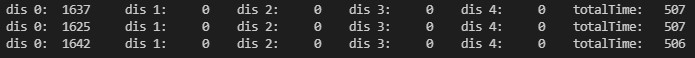
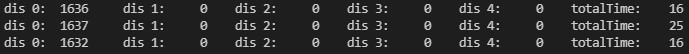
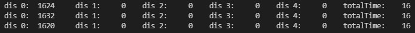
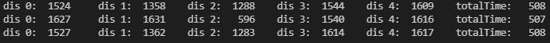
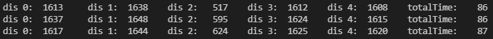
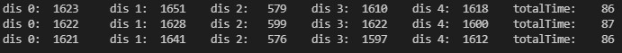
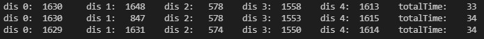

# Onderzoek

Dit markdown bestand bevat wat gegevens over onderzoeken die ik gaandeweg de analyse heb onderzocht.

Het zal bepaalde onderdelen staven waarom ik de desbetreffende zaken in het project heb gekozen.

----

# Inhoudsopgaven

- [Onderzoek](#onderzoek)
- [Inhoudsopgaven](#inhoudsopgaven)
  - [plaats sensoren](#plaats-sensoren)
  - [Snelheid Metingen 1 sensor](#snelheid-metingen-1-sensor)
    - [BLOCKING_CONTINUOUS](#blocking_continuous)
    - [ASYNC_CONTINUOUS](#async_continuous)
  - [Snelheid Metingen 5 sensoren](#snelheid-metingen-5-sensoren)
    - [BLOCKING_CONTINUOUS](#blocking_continuous-1)
    - [ASYNC_CONTINUOUS](#async_continuous-1)


----

## plaats sensoren

Dit project is ontworpen om te reageren op bewegingen gegeven door een gebruiker. Omdat dit meestal een hand zal zijn, moet er gekeken worden hoe de sensoren juist t.o.v. elkaar moeten staan (kruis, ster, cirkel, ...).

Initieel starten we met een beweging dat van links naar rechts beweegt waarbij we 3 ToF-sensoren gebruiken. Deze kunnen we op enkelen manieren opstellen:

<div style="align:center">


</div>

Ik neem voorbeeld 1 omdat dit makkelijker is om een opstelling voor te maken. Voor s1 en s2 hebben we een afstand van 100mm (10cm) gekozen. Dit is ongeveer de breedte van mijn hand. Op deze manier zal 1 enkele sensor mijn hand zien wanneer ik deze ervoor breng en niet alle sensoren tegelijkertijd.

Als de gesture commando's uitgebreid worden, moeten we ook meerdere sensoren gebruiken om ze te kunnen detecteren. Hier hebben we ook enkele ideeën hoe we de sensoren kunnen plaatsen t.o.v. elkaar:


Uiteraard zijn dit niet de enige mogelijke opstellingen. Het is maar een idee hoe we ze kunnen plaatsen.

Wederom voor deze opstelling nemen we de simpelste opstelling dat een kruis voorstelt (1ste foto) met s1 en s2 op 100mm.

?> Wanneer de custom made PCB aankomt (PCBV0.3) kan er geëxperimenteerd worden met meer exotische opstellingen + afstanden.

Bij de gekregen Dev-kit is de genomen opstelling niet mogelijk zonder wat knip en plak werk. Daarom maken we een 3D geprinte opstelling waarop we de sensoren kunnen bevestigen.

<iframe src="https://myhub.autodesk360.com/ue2fad720/shares/public/SH9285eQTcf875d3c5394184e6c7b619f119?mode=embed" width="800" height="600" allowfullscreen="true" webkitallowfullscreen="true" mozallowfullscreen="true"  frameborder="0"></iframe>

Dat uiteindelijk uitkomt op dit:


De printplaat waarop de Nucleo-F401RE bevestigd is, wordt op een houten plaat bevestigd zodat deze verticaal staat. Op deze printplaat staan ook nog extra led's en drukknoppen om de analyse wat zichtbaar te maken.


## Snelheid Metingen 1 sensor

### BLOCKING_CONTINUOUS

!> De metingen die te zien zijn in de terminal screenshots zijn gebeurd zonder kalibratie van de sensor. Daarom dat deze afwijkend zijn van elkaar. De nauwkeurigheid van de sensor(en) heeft geen invloed op dit onderzoek.

Bij de gekregen Dev-kit werden de sensoren met mode *BLOCKING_CONTINUOUS* aangestuurd Dit houd in dat de software zelf zal wachten totdat de sensor terug stuurt dat de data beschikbaar is. Dit proces herhalen we telkens.

|                       |min|typ|max|eenheid|
|-----------------------|---|---|---|-------|
|TimingBudget           |500|35 |16 |ms     |
|gemeten waarde software|507|43 |24 |ms     |

terminal beelden

**minimaal**



**standaard**


**maximaal**


gebruikte code
``` C
 while (1)
      {
        timerTotal = HAL_GetTick();

        getResults(VL53L3A2_DEV_LEFT, Result);

        if ((HAL_GetTick() - timer) >= 2000)
        {
          int dis0 = Result[VL53L3A2_DEV_LEFT].ZoneResult[0].Distance[0];
          int dis1 = Result[VL53L3A2_DEV_CENTER].ZoneResult[0].Distance[0];
          int dis2 = Result[VL53L3A2_DEV_RIGHT].ZoneResult[0].Distance[0];
          int dis3 = Result[VL53L3A2_DEV_TOP].ZoneResult[0].Distance[0];
          int dis4 = Result[VL53L3A2_DEV_BOTTOM].ZoneResult[0].Distance[0];
          timer = HAL_GetTick();
          
          printf("dis 0: %5ld \t dis 1: %5ld \t dis 2: %5ld \t dis 3: %5ld \t dis 4: %5ld \t totalTime: %5d\r\n", dis0, dis1,dis2,dis3,dis4, prevTotalTime);
          prevTotalTime = 0;
        }
        totalTime = HAL_GetTick() - timerTotal;
        if(prevTotalTime < totalTime)
          prevTotalTime = totalTime;
        
        HAL_GPIO_TogglePin(L_Y_GPIO_Port, L_Y_Pin);
      }
```

### ASYNC_CONTINUOUS

Onderstaande metingen zijn uitgevoerd met LEFT sensor (1 sensor) die *ASYNC_CONTINUOUS* werkt. Dit gebeurd d.m.v. een interrupt waar we nadien de gegevens uitlezen en de flag resetten. 
Hier hebben we een maximale snelheid bereiken van 16ms.

|                       |min|typ|max|eenheid|
|-----------------------|---|---|---|-------|
|TimingBudget           |500|35 |16 |ms     |
|gemeten waarde software|16 |16 |24 |ms     |
|gemeten waarde scoop   |494|35 |16 |ms     |

Scope beelden

**minimaal**


**standaard**


**maximaal**


De scoop beelden zeggen dat de tijd die de sensor op interrupt mode staat even lang blijft namelijk +-16ms ongeachte *TimingBudget*. De hoge periodes worden wel beïnvloed door *TimingBudget*. In de software daarentegen wijn de tijden wel korter dan bij *BLOCKING_CONTINUOUS*.

**minimaal**



**standaard**



**maximaal**


Uiteraard krijgen we pas een meeting binnen wanneer de sensor gereed is (een interrupt heeft gecreëerd) wat ook gevolgen heeft voor onze code. De snelheid van de code blijft wel op de 16ms~24ms ongeachte het *TimingBudget*.

code

``` C
while (1)
      {
        timerTotal = HAL_GetTick();

        checkSensorReady(isStarted0, isReady0, VL53L3A2_DEV_LEFT, Result);

        if ((HAL_GetTick() - timer) >= 2000)
        {
          int dis0 = Result[VL53L3A2_DEV_LEFT].ZoneResult[0].Distance[0];
          int dis1 = Result[VL53L3A2_DEV_CENTER].ZoneResult[0].Distance[0];
          int dis2 = Result[VL53L3A2_DEV_RIGHT].ZoneResult[0].Distance[0];
          int dis3 = Result[VL53L3A2_DEV_TOP].ZoneResult[0].Distance[0];
          int dis4 = Result[VL53L3A2_DEV_BOTTOM].ZoneResult[0].Distance[0];
          timer = HAL_GetTick();
          
          printf("dis 0: %5ld \t dis 1: %5ld \t dis 2: %5ld \t dis 3: %5ld \t dis 4: %5ld \t totalTime: %5d\r\n", dis0, dis1,dis2,dis3,dis4, prevTotalTime);
          prevTotalTime = 0;
        }
        totalTime = HAL_GetTick() - timerTotal;
        if(prevTotalTime < totalTime)
          prevTotalTime = totalTime;
        
        HAL_GPIO_TogglePin(L_Y_GPIO_Port, L_Y_Pin);
      }
```

Voor onze applicatie is snelheid van metingen belangrijk zodat de user hierdoor geen hinder door ondervind.

## Snelheid Metingen 5 sensoren

Omdat ons systeem met 5 sensoren werkt zullen we dit ook even onderzoeken of dat we wel degelijk met interrupts de snelheid verhogen of niet. Idem als hierboven late we eerst de terminal screenshots zien in modus *BLOCKING_CONTINUOUS* en nadien de modus *ASYNC_CONTINUOUS* die met interrupts werkt.

### BLOCKING_CONTINUOUS

|                       |min|typ|max|eenheid|
|-----------------------|---|---|---|-------|
|TimingBudget           |500|35 |16 |ms     |
|gemeten waarde software|508|86 |86 |ms     |

**minimaal**



**standaard**



**maximaal**



code 

``` C
while (1)
      {
        timerTotal = HAL_GetTick();

        getResults(VL53L3A2_DEV_LEFT, Result);
        getResults(VL53L3A2_DEV_CENTER, Result);
        getResults(VL53L3A2_DEV_RIGHT, Result);
        getResults(VL53L3A2_DEV_TOP, Result);
        getResults(VL53L3A2_DEV_BOTTOM, Result);

        if ((HAL_GetTick() - timer) >= 2000)
        {
          int dis0 = Result[VL53L3A2_DEV_LEFT].ZoneResult[0].Distance[0];
          int dis1 = Result[VL53L3A2_DEV_CENTER].ZoneResult[0].Distance[0];
          int dis2 = Result[VL53L3A2_DEV_RIGHT].ZoneResult[0].Distance[0];
          int dis3 = Result[VL53L3A2_DEV_TOP].ZoneResult[0].Distance[0];
          int dis4 = Result[VL53L3A2_DEV_BOTTOM].ZoneResult[0].Distance[0];
          timer = HAL_GetTick();

          printf("dis 0: %5ld \t dis 1: %5ld \t dis 2: %5ld \t dis 3: %5ld \t dis 4: %5ld \t totalTime: %5d\r\n", dis0, dis1, dis2, dis3, dis4, prevTotalTime);
          prevTotalTime = 0;
        }
        totalTime = HAL_GetTick() - timerTotal;
        if (prevTotalTime < totalTime)
          prevTotalTime = totalTime;

        HAL_GPIO_TogglePin(L_Y_GPIO_Port, L_Y_Pin);
      }
```

### ASYNC_CONTINUOUS

|                       |min|typ|max|eenheid|
|-----------------------|---|---|---|-------|
|TimingBudget           |500|35 |16 |ms     |
|gemeten waarde software|33 |86 |86 |ms     |

**minimaal**



**standaard**


**maximaal**


code 

``` C
while (1)
      {
        timerTotal = HAL_GetTick();

        checkSensorReady(isStarted0, isReady0, VL53L3A2_DEV_LEFT, Result);
        checkSensorReady(isStarted1, isReady1, VL53L3A2_DEV_CENTER, Result);
        checkSensorReady(isStarted2, isReady2, VL53L3A2_DEV_RIGHT, Result);
        checkSensorReady(isStarted3, isReady3, VL53L3A2_DEV_TOP, Result);
        checkSensorReady(isStarted4, isReady4, VL53L3A2_DEV_BOTTOM, Result);

        if ((HAL_GetTick() - timer) >= 2000)
        {
          int dis0 = Result[VL53L3A2_DEV_LEFT].ZoneResult[0].Distance[0];
          int dis1 = Result[VL53L3A2_DEV_CENTER].ZoneResult[0].Distance[0];
          int dis2 = Result[VL53L3A2_DEV_RIGHT].ZoneResult[0].Distance[0];
          int dis3 = Result[VL53L3A2_DEV_TOP].ZoneResult[0].Distance[0];
          int dis4 = Result[VL53L3A2_DEV_BOTTOM].ZoneResult[0].Distance[0];
          timer = HAL_GetTick();

          printf("dis 0: %5ld \t dis 1: %5ld \t dis 2: %5ld \t dis 3: %5ld \t dis 4: %5ld \t totalTime: %5d\r\n", dis0, dis1, dis2, dis3, dis4, prevTotalTime);
          prevTotalTime = 0;
        }
        totalTime = HAL_GetTick() - timerTotal;
        if (prevTotalTime < totalTime)
          prevTotalTime = totalTime;

        HAL_GPIO_TogglePin(L_Y_GPIO_Port, L_Y_Pin);
      }
```

We kunnen concluderen dat snelheid niet het beste is wanneer we met meerdere sensoren werken. We gaan een balans moeten zoeken tussen de snelheid van het meten en de snelheid van verwerken.

We nemen hier 100 als waarde voor *TimingBudget* wat ons een software delay geeft van +-60ms.