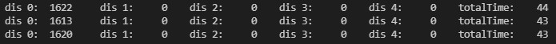
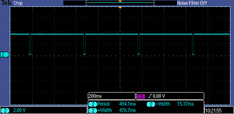
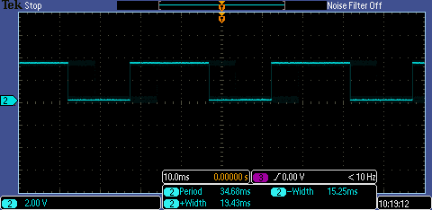
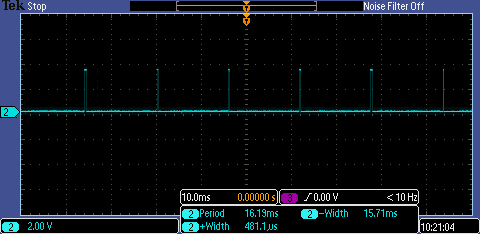

# Onderzoek

Dit markdown bestand bevat wat gegevens over onderzoeken die ik gaandeweg de analyse heb onderzocht.

Het zal bepaalde onderdelen staven waarom ik voor bepaalde zaken in het project heb gekozen.

----

# Inhoudsopgaven

- [Onderzoek](#onderzoek)
- [Inhoudsopgaven](#inhoudsopgaven)
  - [Snelheid Metingen 1 sensor](#snelheid-metingen-1-sensor)
    - [BLOCKING_CONTINUOUS](#blocking_continuous)
    - [ASYNC_CONTINUOUS](#async_continuous)
  - [Snelheid Metingen 5 sensoren](#snelheid-metingen-5-sensoren)
    - [BLOCKING_CONTINUOUS](#blocking_continuous-1)
    - [ASYNC_CONTINUOUS](#async_continuous-1)


----


## Snelheid Metingen 1 sensor

### BLOCKING_CONTINUOUS

!> De metingen die te zien zijn in de terminal screenshots zijn gebeurd zonder kalibratie van de sensor. Daarom dat deze zo afwijkend zijn van elkaar. Dit onderzoek heeft geen effecten op de nauwkeurigheid van de sensor.

Bij de gekregen Dev-kit werden de sensoren met mode *BLOCKING_CONTINUOUS* aangestuurd Dit houd in dat de software zelf zal wachten totdat de sensor terug stuurt dat de data beschikbaar is. Dit proces herhalen we telkens.

|                       |min|typ|max|eenheid|
|-----------------------|---|---|---|-------|
|TimingBudget           |500|35 |16 |ms     |
|gemeten waarde software|507|43 |24 |ms     |

terminal beelden

**minimaal**


**standaard**



**maximaal**


gebruikte code
``` C
 while (1)
      {
        timerTotal = HAL_GetTick();

        getResults(VL53L3A2_DEV_LEFT, Result);

        if ((HAL_GetTick() - timer) >= 2000)
        {
          int dis0 = Result[VL53L3A2_DEV_LEFT].ZoneResult[0].Distance[0];
          int dis1 = Result[VL53L3A2_DEV_CENTER].ZoneResult[0].Distance[0];
          int dis2 = Result[VL53L3A2_DEV_RIGHT].ZoneResult[0].Distance[0];
          int dis3 = Result[VL53L3A2_DEV_TOP].ZoneResult[0].Distance[0];
          int dis4 = Result[VL53L3A2_DEV_BOTTOM].ZoneResult[0].Distance[0];
          timer = HAL_GetTick();
          
          printf("dis 0: %5ld \t dis 1: %5ld \t dis 2: %5ld \t dis 3: %5ld \t dis 4: %5ld \t totalTime: %5d\r\n", dis0, dis1,dis2,dis3,dis4, prevTotalTime);
          prevTotalTime = 0;
        }
        totalTime = HAL_GetTick() - timerTotal;
        if(prevTotalTime < totalTime)
          prevTotalTime = totalTime;
        
        HAL_GPIO_TogglePin(L_Y_GPIO_Port, L_Y_Pin);
      }
```

### ASYNC_CONTINUOUS

Onderstaande metingen zijn uitgevoerd met LEFT sensor (1 sensor) die *ASYNC_CONTINUOUS* werkt. Dit gebeurd d.m.v. een interrupt waar we nadien de gegevens uitlezen en de flag resetten. 
Hier hebben we een maximale snelheid bereiken van 16ms.

|                       |min|typ|max|eenheid|
|-----------------------|---|---|---|-------|
|TimingBudget           |500|35 |16 |ms     |
|gemeten waarde software|16 |16 |24 |ms     |
|gemeten waarde scoop   |494|35 |16 |ms     |

Scope beelden

**minimaal**



**standaard**



**maximaal**




De scoop beelden zeggen dat de tijd die de sensor op interrupt mode staat even lang blijft namelijk +-16ms ongeachte *TimingBudget*. De hoge periodes worden wel beïnvloed door *TimingBudget*. In de software daarentegen wijn de tijden wel korter dan bij *BLOCKING_CONTINUOUS*.

**minimaal**


**standaard**


**maximaal**


Uiteraard krijgen we pas een meeting binnen wanneer de sensor gereed is (een interrupt heeft gecreëerd) wat ook gevolgen heeft voor onze code. De snelheid van de code blijft wel op de 16ms~24ms ongeachte het *TimingBudget*.

code

``` C
while (1)
      {
        timerTotal = HAL_GetTick();

        checkSensorReady(isStarted0, isReady0, VL53L3A2_DEV_LEFT, Result);

        if ((HAL_GetTick() - timer) >= 2000)
        {
          int dis0 = Result[VL53L3A2_DEV_LEFT].ZoneResult[0].Distance[0];
          int dis1 = Result[VL53L3A2_DEV_CENTER].ZoneResult[0].Distance[0];
          int dis2 = Result[VL53L3A2_DEV_RIGHT].ZoneResult[0].Distance[0];
          int dis3 = Result[VL53L3A2_DEV_TOP].ZoneResult[0].Distance[0];
          int dis4 = Result[VL53L3A2_DEV_BOTTOM].ZoneResult[0].Distance[0];
          timer = HAL_GetTick();
          
          printf("dis 0: %5ld \t dis 1: %5ld \t dis 2: %5ld \t dis 3: %5ld \t dis 4: %5ld \t totalTime: %5d\r\n", dis0, dis1,dis2,dis3,dis4, prevTotalTime);
          prevTotalTime = 0;
        }
        totalTime = HAL_GetTick() - timerTotal;
        if(prevTotalTime < totalTime)
          prevTotalTime = totalTime;
        
        HAL_GPIO_TogglePin(L_Y_GPIO_Port, L_Y_Pin);
      }
```

Voor onze applicatie is snelheid van metingen belangrijk zodat de user hierdoor geen hinder door ondervind.

## Snelheid Metingen 5 sensoren

Omdat ons systeem met 5 sensoren werkt zullen we dit ook even onderzoeken of dat we wel degelijk met interrupts de snelheid verhogen of niet. Idem als hierboven late we eerst de terminal screenshots zien in modus *BLOCKING_CONTINUOUS* en nadien de modus *ASYNC_CONTINUOUS* die met interrupts werkt.

### BLOCKING_CONTINUOUS


### ASYNC_CONTINUOUS