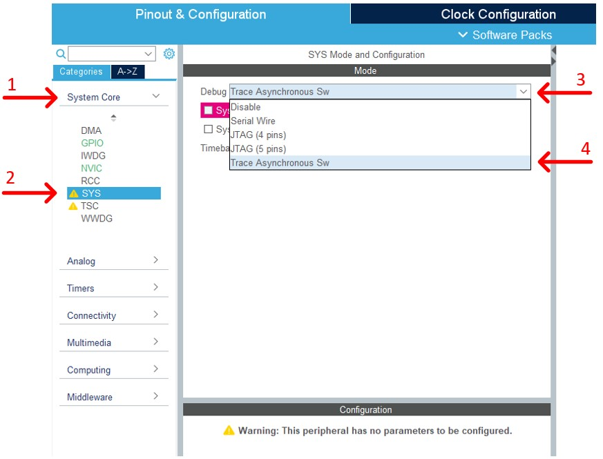
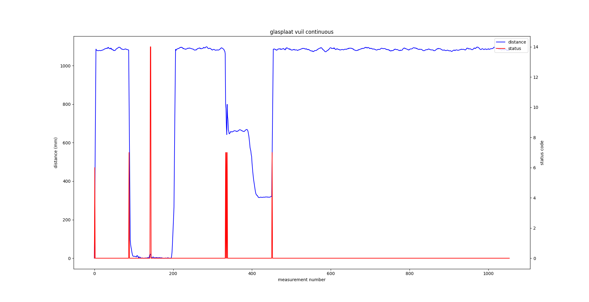

# Gesture Control

> Made By Robbe Elsermans 

Het Gesture Control project is een bachelor proef gemaakt op het bedrijf [ED&A](https://www.edna.eu/nl) en gecoördineerd door [AP Hogeschool](https://www.ap.be/).

Graag bedank ik al de collega's die me - tijdens deze leerrijke periode - hebben geholpen om dit project tot een goed einde te brengen.

----

# Inhoudsopgaven

- [Gesture Control](#gesture-control)
- [Inhoudsopgaven](#inhoudsopgaven)
- [Inleiding](#inleiding)
- [Project Definitie](#project-definitie)
- [Gebruikte Software](#gebruikte-software)
- [Gebruikte Hardware](#gebruikte-hardware)
- [Opbouw Project](#opbouw-project)
  - [PinOut](#pinout)
    - [Pin description](#pin-description)
  - [genereer code](#genereer-code)
  - [Importeer API VL53LXC](#importeer-api-vl53lxc)
  - [importeren include & src bestanden](#importeren-include--src-bestanden)
  - [Importeer Andere Bestanden](#importeer-andere-bestanden)
  - [Installeer Platform & Board](#installeer-platform--board)
  - [configureer platformio.ini file](#configureer-platformioini-file)
  - [main.h & .c](#mainh--c)
  - [Overzicht Bestanden](#overzicht-bestanden)
  - [Build & Upload](#build--upload)
  - [full project](#full-project)
- [Hardware Opbouw](#hardware-opbouw)
- [LED Controller](#led-controller)
- [Onderzoek](#onderzoek)
  - [Plaats Sensoren Development Kit](#plaats-sensoren-development-kit)
  - [Snelheid Metingen Development Kit](#snelheid-metingen-development-kit)
    - [Eén sensor](#eén-sensor)
      - [BLOCKING_CONTINUOUS](#blocking_continuous)
      - [ASYNC_CONTINUOUS](#async_continuous)
    - [Vijf sensoren](#vijf-sensoren)
      - [BLOCKING_CONTINUOUS](#blocking_continuous-1)
      - [ASYNC_CONTINUOUS](#async_continuous-1)
  - [Plaats Sensoren PCBV0.3](#plaats-sensoren-pcbv03)
    - [Kruislings](#kruislings)
    - [Piramide](#piramide)
    - [Trap](#trap)
  - [Snelheid Metingen PCBV0.3](#snelheid-metingen-pcbv03)
  - [Coverglas](#coverglas)
    - [plexiplaat](#plexiplaat)
    - [glasplaat](#glasplaat)
  - [Smudge Detection plexiplaat](#smudge-detection-plexiplaat)
    - [Normale werking](#normale-werking)
    - [VL53LX_SMUDGE_CORRECTION_SINGLE](#vl53lx_smudge_correction_single)
    - [VL53LX_SMUDGE_CORRECTION_CONTINUOUS](#vl53lx_smudge_correction_continuous)
  - [Smudge Detection glasplaat](#smudge-detection-glasplaat)
    - [Normale werking](#normale-werking-1)
    - [VL53LX_SMUDGE_CORRECTION_SINGLE](#vl53lx_smudge_correction_single-1)
    - [VL53LX_SMUDGE_CORRECTION_CONTINUOUS](#vl53lx_smudge_correction_continuous-1)
  - [Trap in software verwerkt](#trap-in-software-verwerkt)
    - [Op papier](#op-papier)
    - [Met Data](#met-data)
  - [Bevindingen & Upgrades](#bevindingen--upgrades)

----

# Inleiding

Het is de bedoeling dat dit document gebruikt kan worden om van scratch heel de software omgeving op te zetten en te kunnen gebruiken.
Ook wordt er een sectie voorzien over de hardware aanpassingen die gebeurd zijn doorlopen het project.
Als laatste wordt er een sectie voorzien hoe dit systeem met een ander systeem kan communiceren met voorbeeld code.

Helemaal onderaan staan de uitgewerkte onderzoeken die ik terloops dit project heb uitgezocht. Dit zijn zaken zoals het testen van de soorten modi waarin de sensor kon gebruikt worden en het soort coverglas (glas of plexi).

Bij het begin van dit project had ik geen kennis over het programmeren van 32-bit microcontrollers. 
STM32CUBEIDE was me destijds ook onbekend. Gaandeweg dit project zijn beide items duidelijk geworden.

Tijdens het middelbaar en hoger onderwijs heb ik de basis mee gekregen om een ordelijke PCB op te stellen. in dit project is de zelfzekerheid en het kritisch denken over hoe je het best een PCB opbouwt verhoogt.

De API geschreven door ST-Elektronics ([hier](https://www.st.com/content/st_com/en/products/embedded-software/imaging-software/stsw-img015.html) te vinden) zal in dit document niet volledig beschreven worden. Enkel de gebruikte calls worden in de code wat verduidelijkt. De handleiding om met de gegeven API te werken is [hier](https://www.st.com/resource/en/data_brief/stsw-img015.pdf) te vinden.

De gebruikte bibliotheek wordt in dit document opgesteld zodat deze stap voor stap na gebouwd kan worden. Er is ook een werkende bibliotheek (en source code) aanwezig in de repo onder [GestureControl/Code PlatformIO/GestureControlFinal/lib](https://github.com/RobbeElsermans/GestureControl/tree/main/Code%20PlatformIO/gesture%20Control%20Final/lib).

----

# Project Definitie

Het doel van dit project is om een apparaat te ontwikkelen die de user interface een extra dimensie geeft via handbewegingen. Hierdoor is de user niet gelimiteerd tot aanrakingen of spraak maar ook beweging van de handen. De handbewegingen gaan we detecteren met één (of meerdere) “goedkope” Time of Flight (ToF)-sensor(en). De data verkregen van de ToF-sensor(en) zal verwerkt worden met een geschikte Microcontroller (MCU).

De handbewegingen gaan voor deze opstelling simpel zijn zodat de scope niet te groot wordt in dit project. Ook zal er rekening gehouden worden met storing-factoren zoals een cover glas en/ of omgevingslicht. Hiermee verhoogt het applicatiegebied aanzienlijk.
Om de verwerkte data te gebruiken is een interface een must have. Hiermee kan de hand gesture controller gemakkelijk gekoppeld worden aan een apparaat naar keuzen.

----

# Gebruikte Software

Deze sectie zal de gebruikte software bevatten en waarom we deze gebruikt hebben. Ook welke versie er gebruikt is. Een download link/ installatie link wordt mee voorzien.

<div style="color:black; background-color:white">

| Software | Versie | Argumentatie | Link |
| -------- |: ------    | ------------  | ----      |
| STM32CubeIDE   |  V1.4.0    |De software geschreven door ST. Hiermee is het makkelijk om de MCU te pre-configureren zonder 1 lijn code te schrijven. Zo worden alle peripherals en GPIO gebruik, automatisch gegenereerd op basis van een userinterface. Op deze manier kunnen we een clean start maken van het project zonder te veel code te schrijven voor het initialiseren van de MCU.|[link](https://www.st.com/en/development-tools/stm32cubeide.html)|
|   Visual Code   |V1.65.2   | Een "open source" editor die een groot ecosysteem heeft van plugins. Deze editor is vooral gekozen omdat ik hier ervaring mee heb. Ook omdat dit draait op Linux.|[link](https://code.visualstudio.com/)|
| PlatformIO  IDE | Home: V3.x.x  Core: V6.x.x | Een plugin van Visual Code om de STM32Nucleo te programmeren en hardware debugging uit te voeren.  | [link](https://platformio.org/install/ide?install=vscode)
|Docsify|V4.4.4|Om deze documentatie te schrijven is er gebruik gemaakt van Docsify die de markdown bestanden omzet in een interactieve website. |[link](https://docsify.js.org/)|
|ST STM32 Platform| V15.x.x | PlatformIO ST STM32 platform | [link](https://github.com/platformio/platform-ststm32?utm_source=platformio&utm_medium=piohome)|
</div>

----

# Gebruikte Hardware

We lijsten in volgende tabel op wat we precies gebruikt hebben om onze hardware te vervaardigen (aka BOM). Ook staat hierbij de plaats op de PCB.

<div style="color:black; background-color:white">

<iframe src="./Hardware/ibom.html" title="BOM PCB0.3" height="1000"></iframe>
</div>

<a href="./Hardware/ibom.html" target="_blank">Hier</a>  de link om het op een aparte pagina te bekijken.

----

# Opbouw Project

Initieel ben ik gestart met STM32CubeIDE omdat hierbij examples geleverd waren om de desbetreffende ToF-sensoren te gebruiken. Hierdoor kon ik me eerst focussen op het leren werken met de ToF-sensoren en met STM32CubeIDE.

Nadien zag ik de mogelijkheid om met PlatformIO IDE (plugin van Visual Code) verder te werken. Het is een vertrouwde omgeving en de basis functionaliteiten zijn hetzelfde als bij STM32CubeIDE.

Omdat de gegenereerde code in STM32CubeIDE wel heel handig is, heb ik het project eerst in STM32CubeIDE opgezet (configuratie I²C, GPIO, ...) en nadien de bestanden overgeplaatst naar het PlatformIO project. uiteraard heeft PlatformIO ook de nodige HAL(Hardware Abstraction Layer) bibliotheken nodig om de gegenereerde code te compileren. Later bespreken we hoe we deze installeren.

Om met de ToF-sensoren aan de slag te gaan, heb ik gebruik gemaakt van het development kit [P-NUCLEO-53L3A2](https://www.st.com/en/evaluation-tools/p-nucleo-53l3a2.html) die een voor-gecompileerde bibliotheek meegeleverd kreeg. Hier heb ik eerst met leren werken. Nadien ben ik overgestapt naar de *"Bare API"* en hier al de nodige extra bestanden, die we moeten toevoegen om het compatibel te maken met het gebruikte platform, aan toe gevoegd.

----

## PinOut

In onderstaande Miro sheets worden de pinouts weergegeven van zowel de (mogelijke) MCU(s) als de ST Morpho Extention pin header.


PCB Pinout F401RxT
<iframe width="768" height="600" src="https://miro.com/app/live-embed/uXjVOF_Iavc=/?moveToViewport=-1493,-812,2822,1560" frameBorder="0" scrolling="no" allowFullScreen></iframe>

PCB Pinout F151Lx
<iframe width="768" height="600" src="https://miro.com/app/live-embed/uXjVOC73SG8=/?moveToViewport=-794,-502,1535,853" frameBorder="0" scrolling="no" allowFullScreen></iframe>

PCB Pinout F302Rx
<iframe width="768" height="600" src="https://miro.com/app/live-embed/uXjVO7LxdQU=/?moveToViewport=-355,-347,595,605" frameBorder="0" scrolling="no" allowFullScreen></iframe>

!> Merk op dat we **EXTERN1** & **EXTERN2** hebben moeten vervangen door **I2C2_SDA** & **I2C2_SCL**. 

ST Morpho Extention pin header
<iframe width="768" height="600" src="https://miro.com/app/live-embed/uXjVOF_cksw=/?moveToViewport=-1651,-1262,3867,2149" frameBorder="0" scrolling="no" allowFullScreen></iframe>


### Pin description 

<div style="display:inline-block; background-color:white">
<table style="background-color: white; color: black; display:inline;">
  <tr>
    <th>naam</th>
    <th>type</th>
    <th>default state</th>
  </tr>
  <tr>
    <td>XSHUT_0</td>
    <td>GPIO_Output</td>
    <td>HIGH</td>
  </tr>
  <tr>
    <td>XSHUT_1</td>
    <td>GPIO_Output</td>
    <td>HIGH</td>
  </tr>
    <tr>
    <td>XSHUT_2</td>
    <td>GPIO_Output</td>
    <td>HIGH</td>
  </tr>
    <tr>
    <td>XSHUT_3</td>
    <td>GPIO_Output</td>
    <td>HIGH</td>
  </tr>
    <tr>
    <td>XSHUT_4</td>
    <td>GPIO_Output</td>
    <td>HIGH</td>
  </tr>
    <tr>
    <td>GPIOI_0</td>
    <td>GPIO_EXTIx</td>
    <td>HIGH</td>
  </tr>
    <tr>
    <td>GPIOI_1</td>
    <td>GPIO_EXTIx</td>
    <td>HIGH</td>
  </tr>
    <tr>
    <td>GPIOI_2</td>
    <td>GPIO_EXTIx</td>
    <td>HIGH</td>
  </tr>
    <tr>
    <td>GPIOI_3</td>
    <td>GPIO_EXTIx</td>
    <td>HIGH</td>
  </tr>
    <tr>
    <td>GPIOI_4</td>
    <td>GPIO_EXTIx</td>
    <td>HIGH</td>
  </tr>  
  <tr>
    <td>LED_0</td>
    <td>GPIO_Output</td>
    <td>LOW</td>
  </tr>
  <tr>
    <td>LED_1</td>
    <td>GPIO_Output</td>
    <td>LOW</td>
  </tr>  
  <tr>
    <td>LED_2</td>
    <td>GPIO_Output</td>
    <td>LOW</td>
  </tr>  
  <tr>
    <td>LED_3</td>
    <td>GPIO_Output</td>
    <td>LOW</td>
  </tr>
  <tr>
    <td>LED_4</td>
    <td>GPIO_Output</td>
    <td>LOW</td>
  </tr>
  <tr>
    <td>SW_1</td>
    <td>GPIO_Input</td>
    <td>LOW</td>
  </tr>
  <tr>
    <td>SW_2</td>
    <td>GPIO_Input</td>
    <td>LOW</td>
  </tr>
  <tr>
    <td>EN_5V</td>
    <td>GPIO_Output</td>
    <td>HIGH</td>
  </tr>
</table>
</div>

----

## genereer code

Om het onszelf makkelijk te maken gaan we gebruik maken van de STM32CubeIDE tools die voor ons de code genereert.

?> Om de foto's te vergroten kan u er op drukken.

1. Installeer [STM32CubeIDE](https://www.st.com/en/development-tools/stm32cubeide.html) en open dit in een directory naar keuzen.

<!--  -->


2. Start een nieuw project op. Dit kan even duren vooraleer een nieuwe window verschijnt.

<!--  -->


1. Type in **Part Number** het volgende: *stm32f302rc*. Nadien selecteer je in de tabel de 1ste rij om nadien op **Next** te drukken.

<!--  -->


4. Een nieuw venster verschijnt waarin we de naam, de locatie en de programmeer taal dat we willen gebruiken instellen. De naam is vrij te kiezen net zoals de locatie van het project. Ik neem hier *GestureController* als naam en de locatie laat ik op default staan. Als programmeer taal gaan we C nemen. Nu drukken we op **Finish** zodat ons project wordt aangemaakt. Men zal vragen of dat men het **Device Configuration Tool perspective** mag openen. Druk hierbij op **Yes**.

<!-- 
 -->


?> Nu bevinden we ons in ST's hun (mijn mening) handigste tool ooit. Hier kunnen we op grafischer wijze heel ons project opbouwen zonder 1 lijn code te schrijven.

5. Nu gaan we de ToF-sensor extensie installeren zodat we de nodige code kunnen laten genereren. Hiervoor gaan we naar de dropdown **Software Packs** vervolgens **Manage Software Packs** (of ALT+U)

<!--  -->


1. In het popup-venster **Embedded Software packages Manager** gaan we bovenaan naar de 2de tab **STMicroelektronics** en zoeken we in de lijst naar **X-CUBE-TOF1** waar we vervolgens in de dropdown versie 1.0.0 aanvinken & versie 3.0.0 aanvinken. Installeer deze.

<!--  -->


!> men vraagt voor akkoord (of niet akkoord) te gaan met de licentie van de software. Als we niet akkoord gaan kunnen we uiteraard de software niet gebruiken. Ik ga dus akkoord.

Wanneer de installatie voltooid is, zou het vinkje volledig groen moeten zijn. Sluiten het **Embedded Software packages Manager** venster.

<!--  -->


7. Vervolgens plaatsen we de pin gegevens (die te vinden zijn in hoofdstuk [PinOut](#pinout) meer bepaald in foto **PCB Pinout F302Rx** en in hoofdstuk [Pin description](#pin-description)) in de grafische editor. Zoals de opmerking zegt, is I2C2 op een andere pin dan de MCU's die we in gedachten hadden om te gebruiken. Dit wordt in hoofdstuk [Hardware Opbouw](#hardware-opbouw) beschreven hoe we dit aanpassen met PCBV0.3.

Om een pin te definiëren gaan we met de cursor van de muis op de desbetreffende pin staan. Met de linker muisknop komt er een dropdown waarin alle opties staan die de geselecteerde pin kan hebben. Hieronder een voorbeeld hoe we XSHUT_0 - dat een GPIO_Output is en zich op PC0 bevindt - definiëren. We geven de pin ook een naam zodat dit later in de code leesbaar is.

<!--  -->


Om een naam te geven klikken we met de rechter muisknop op de aangemaakte GPIO pin en selecteren we **Enter User label** om dan een naam in te kunnen geven.

<!--  -->


Dit herhalen we totdat we al de XSHUT, GPIOI, LED en SW pinnen hebben gedeclareerd. Dit resulteert in onderstaande foto:

<!--  -->


Nu rest ons nog om voor de interrupts (GPIOI_0->4) code te laten genereren. Dit vinden we in de zijbalk onder **System Core** -> **NVIC** die ons een ander zijbalk 
toont waarin we **EXTI line [9:5] interrupts** en **EXTI line [15:10] interrupts** aanvinken. Dit zal later voor ons de code activeren.

<!--  -->


8. Na het plaatsen van de input, output en interrupt pinnen, moeten de peripheral pinnen nog gedeclareerd worden (zoals I2C1, I2C2, Externe clock, UART, ...). Dit vergt iets meer werk dan voorgaande stap.
   1. Als eerste gaan we de programming peripheral activeren genaamd **Async Serial Wire**. Dit doen we door in de zijbalk onder **System Core** -> **SYS** bij de dropdown **Debug** de laatste optie **Trace Asynchronous Sw** te selecteren. Na de selectie zullen er enkele pinnen groen worden en een naam krijgen.
<!--  
    -->

   
   
   
   2. Het volgende dat we gaan instellen zijn de externe klok kristallen. Hiervoor gaan we ook onder **System Core** naar **RCC** waar we dan de HSE (High Speed Clock) en de LSE (Low Speed Clock) kunnen instellen. Beiden worden geplaatst op **Crystal/Ceramic Resonator**. Wederom worden er enkele pinnen groen met een naam.
    
    <!-- 
     -->

    
    
    
    Nu dat de pinnen gedefinieerd zijn, kunnen we de klok zelf definiëren. Dit doen we in een andere tab (die bovenaan te vinden is) genaamd **Clock Configuration**. Hierin gaan we 2 bolletjes van plaats veranderen. Bij **PLL Source Mux** veranderen we het bolletje van **HSI** naar **HSE**. Bij **System Clock Mux** veranderen we het bolletje van **HSI** naar **PLLCLK**. Later komen we hier nog enkele zaken aanpassen.

    <!--  -->

    

   3. We keren terug naar de **Pinout & Configuration** tab bovenaan. Nu gaan we de FTDI peripheral aanmaken op **USART1**. Hiervoor gaan we onder **Connectivity** -> **USART1** de volgende zaken wijzigen:
      - Mode: Asynchronous
      - Hardware Flow Control (RS232): CTS/RTS
      - Baud Rate: 115200
      - TX and RX Pins Swapping: Enable (We wisselen de pinnen omdat dit tijdens het tekenen van het schema niet juist is gebeurd)
    
    <!-- 
     -->

    
    

    Zoals te zien op de foto zijn er weer enkele pinnen groen geworden met hun bijhorende naam. Merk op dat USART1_RX en USART1_TX niet op de juiste plaatst staat. Om de pin op de juiste plaats te zetten, gaan we met de muis over de pin USART1_RX staan en we drukken Ctrl+linker muisknop. nu zal je andere pinnen zien pinken. Deze pinnen kunnen de functie (USART1_RX) eveneens aansturen.

    <!--  -->

    

    We slepen dus de vastgenomen pin naar PB7. Dit doen we ook voor USART1_TX maar dan naar PB6. Nu staat de pin juist.
      
    <!--  -->

    

   4. Een van de belangrijkste peripheral is toch I2C1 die in communicatie gaat met de ToF-sensoren. Deze stellen we in via **Connectivity** -> **I2C1** waar we de dropdown op **I2C** plaatsen. De snelheid van de klok stellen we in op **Fast Mode Plus** (1MHz frequentie).
   
   <!--  -->

   

   Net zoals bij de USART1 peripheral staan de pinnen niet zoals we het willen. Hier wordt hetzelfde gedaan als met USART1_RX & USART1_TX maar dit dan met I2C1_SCL. We verplaatsen I2C1_SCL van PA15 naar PB8.

   <!--  -->

   

   5. De 2de belangrijkste peripheral is I2C2 die in slave mode zal staan zodat andere toestellen hiermee verbinding kunnen aangaan. Net zoals hierboven gaan we in de zijbalk bij **Connectivity** naar **I2C2** waar we in de dropdown **I2C** selecteren en we stellen zijn adres in op **32** (HEX: 0x20).

    <!--  -->

    

    Omdat we met de gesture controller niet willen wachten totdat de master iets stuurt, zal dit over een interrupt verlopen. Hiervoor gaan we naar de tab **NVIC Settings** waar we **I2C2 event global interrupt / I2C2 wake-up interrupt through EXTI line 24** aanvinken.

    <!--  -->

    

    De pinnen worden nu wel juist geplaatst. Later worden de pinnen doorverbonden op de PCBV0.3 (zie [Hardware Opbouw](#hardware-opbouw)).

    <!--  -->

    

    6. De klok sources van beide I2C modules staan nog niet juist. Dit doen we in een andere tab (die bovenaan te vinden is) genaamd **Clock Configuration**. Hierin gaan we 2 bolletjes van plaats veranderen. Bij **I2C1 Clock Mux** plaatsen we het bolletje naar **SYSCLK**. Dit doen we ook bij **I2C2 Clock**.

    

1. De MCU heeft al de aansluitingen gekregen die nodig zijn voor de GestureController. De ToF-sensor bibliotheek gaan we nu importeren om dan automatisch te laten integreren met de genomen MCU. Hiervoor gaan we naar **Software Packs** -> **Select Components** (of Alt+O). Er komt een tabel tevoorschijn. 

<!--  -->


De rij **STMicroelektronics.X-CUBE-TOF1** vouwen we open om dan door te gaan naar **Board Part Ranging** waar we **VL53L3CX** selecteren. We vouwen ook **Device ToF1_Applications** open om daar in de dropdown **VL53L3CX_SimpleRanging** te selecteren. Dit zal een oranje driehoek tevoorschijn laten komen. Wanneer we op deze driehoek klikken met de linker muisknop, zal er onderaan in de kader **Component dependencies** informatie tevoorschijn komen. Hier klikken we met de linker muisknop op **Resolve** wat automatisch voor ons de dependencies zal oplossen.

<!--  -->


De ToF-sensor bibliotheek is te configureren in de tab **Software Packs**->**STMicroelectronics.X-CUBE-TOF1.3.0.0**. Hier gaan we het eerste vinkjes selecteren in de kader **Mode**. In de kader **Configuration** stellen we in welke pin voor wat in staat. Omdat we onze pinnen al gedefinieerd hebben is het enkel maar de dropdown open doen en een correcte pin selecteren. We nemen in dit geval voor XSHUT pin PC0 en voor I2C nemen we I2C1 met adres 82 (HEX: 0x52) dat het default adres is van de ToF-sensoren. Later in de code wordt er bijna geen gebruik gemaakt van deze instellingen. Dit moet gewoon ingevuld zijn zodat ST de code voor ons kan genereren.

<!--  -->


10. Een laatste wijziging voeren we door zodat al de peripherals in apare c en h bestanden geplaatst worden. Dit is overzichtelijker maar niet noodzakelijk. Hiervoor ga je naar **Project manager**->**Code Generation** waar we de regel **Generate peripheral initialization as a pair of '.c/.h' files per peripheral** aanvinken.

<!--  -->


Nu is het tijd om de code te genereren. Als we op ctrl+s (opslaan) drukken, dan zal er een popup verschijnen om de code te genereren. Nadien volgt een andere popup om het perspectief om te zetten naar C/C++ perspectief. Bij de 2 popups druk je op **Yes**. De code wordt gegenereerd. 

Omdat ik mijn project in PlatformIO heb gemaakt, zal ik hier nog verder beschrijven hoe we dit daarin importeren. Men kan vanaf hieruit ook alles in STM32CubeIDE uitvoeren net zoals in PlatformIO (mits het toevoegen van de zelf gemaakte bestanden).

----


## Importeer API VL53LXC

Zoals gezegd in de [inleiding](#inleiding) hebben we voor de ToF-sensoren een API ter beschikking geschreven door ST zelf. Hier hebben we de **modules** en **porting** folder onder **BSP/Components/vl53l3cx** waarin de .h en .c  bestanden staan. Deze bestanden gaan we overbrengen naar de **lib** folder waar we al de bestanden kopiëren in de map **BSP_vl53l3cx** onder de folder **src**. 


Wanneer we het gegenereerde project opendoen met de VL53L3CX sensoren, staan er nog enkele andere bestanden onder **BSP/Components/vl53l3cx.h & .c** en **TOF/Target** in die van belang zijn:

* vl53l3cx.h
* vl53l3cx.c
* custom_tof_conf.h

Deze bestanden moeten eveneens in de folder **BSP_vl53l3cx** geplaatst worden.

!> Het is belangrijk dat we de bestanden rechtstreeks hierin plaatsen. We verkrijgen dus een map waarin zowel .h als .c bestanden staan. PlatformIO's [Library Dependency Finder (LDF)](https://docs.platformio.org/en/stable/librarymanager/ldf.html) werkt namelijk niet met een een *inc* folder. Voor simpliciteit gaan we dus alle .c en .h bestanden samen voegen in dezelfde folder genaamd **src**.

?> Al de bestanden die we nu overzetten, zijn gegenereerd in STM32CubeIDE (zie [genereer code](#genereer-code)).

In het bestand **custom_tof_conf.h** moeten we nog een lijn code toevoegen tussen **/\* USER CODE BEGIN 1 \*/** en **/\* USER CODE END 1 \*/** (lijn 34) om de gemaakte code te laten werken. 

``` C custom_tof_conf.h
/* USER CODE BEGIN 1 */
#define CUSTOM_VL53L3CX_I2C_GetTick   BSP_GetTick
/* USER CODE END 1 */

``` 

## importeren include & src bestanden

We importeren de bestanden die het eigenlijke project (deels) tot leven brengen. Dit zijn al de bestanden die te vinden zijn onder de folder **Core/Inc** en **Core/Src**. We plaatsen al de bestanden van **Core/Inc** in de **include** folder en de **Core/Src** in de **src** folder. 


Dit zijn de bestanden:

* main.h
* custom_bus.h
* custom_conf.h
* custom_errno.h
* gpio.h
* i2c.h
* stm32f3xx_hal_conf.h
* stm32f3xx_it.h
* uart.h
* uart.c
* stm32f3xx_hal_msp.c
* system_stm32f3xx.c
* main.c
* syscalls.c
* sysmem.c
* custom_bus.c
* gpio.c
* i2c.c
* stm32f3xx_it.c

?> deze bestanden zijn wederom gegenereerd door STM32CubeIDE. Later wijzigen we nog enkelen.

----

## Importeer Andere Bestanden

Naast de gekregen API van ST, zijn er nog andere bestanden gegenereerd onder **CMSIS** en **STM32F3xx_HAL_Driver**.
Deze 2 bibliotheken zetten we elks apart in een bestand met een src map waarin we alle .h en .c bestanden plaatsen van die bibliotheek. We maken dus een folder **CMSIS** en een folder **STM32F3xx_HAL_Driver** met beiden een map **src**. Nu plaatsen we elk .c of .h bestand in de src folder van die bibliotheek.

De bestanden die het project tot leven brengen zijn nog niet geïmporteerd. We hebben een map [**Gesture_Detect**](https://github.com/RobbeElsermans/GestureControl/tree/main/Code%20PlatformIO/gesture%20Control%20Final/lib/Gesture_Detect/src) die we in de folder **lib** moeten plaatsen.

----

## Installeer Platform & Board

Om PlatformIO goed te kunnen gebruiken moeten we het platform **ST STM32** installeren zodat we de software kunnen compileren.

<div style="display:inline">


</div>
<!--  -->

In de figuur (die linksboven afgebeeld is) is de 1<sup>ste</sup> kader, de kader om de dropdown te openen waarin we de 2<sup>de</sup> kader vinden. We selecteren hier *platforms*.

Nadien komen we op de figuur rechtsboven uit. We selecteren *Embedded* bovenaan en we zoeken naar *ST*. We zien dan in de lijst *ST STM32* verschijnen. Wanneer we hier op drukken, kunnen we het platform installeren met de juiste versie (V15.3.0).

----

## configureer platformio.ini file

Het platform.ini bestand is een belangrijk bestand. Hierin wordt de configuratie van het project geplaatst.

Hieronder is de content dat je in dit bestand moet plaatsen.

``` platformio.ini
[env:custom_f302rct6]
platform = ststm32
board = custom_f302rct6
framework = stm32cube
test_transport = custom
monitor_speed = 115200
```

Met deze tekst stellen we in dat de compiler, het framework van *stm32cube* moet gebruiken. Zo worden de HAL-bibliotheken aangesproken. Ook wordt er gedefinieerde welk board dat we gebruiken. Voor debug redenen zal de baudrate ingesteld worden op 115200. Het voorafgaande platform dat geïnstalleerd is, plaatsen we hier ook in.

De test_transponder parameter is toegevoegd zodat we optimaal gebruik kunnen maken van Unit testing. De nodige bestanden hiervoor zijn **unittest_transport.c** & **unittest_transport.h** die onder de folder **test** gezet moet worden. [Hier](https://docs.platformio.org/en/stable/plus/unit-testing.html) is wat extra uitleg over wat dit nu juist doet en hoe het gebruikt moet worden.

Omdat we werken met de STM32F302RCT6, die (nog) niet ondersteund is door PlatformIO, moeten we hier onze eigen spin aan geven. Er wordt een bestand genaamd **custom_f302rct6.json** aangemaakt en het wordt in de folder **boards** geplaatst met volgende content:

``` json custom_f302rct6
{
  "build": {
    "core": "stm32",
    "cpu": "cortex-m4",
    "extra_flags": "-DSTM32F302xC",
    "f_cpu": "32000000L",
    "mcu": "stm32f302rc",
    "product_line": "STM32F302xC",
    "variant": "STM32F3xx/F302R(B-C-D-E)T"
  },
  "debug": {
    "default_tools": [
      "stlink"
    ],
    "jlink_device": "STM32F302RE",
    "openocd_target": "stm32f3x",
    "svd_path": "STM32F302x.svd"
  },
  "frameworks": [
    "arduino",
    "cmsis",
    "mbed",
    "stm32cube",
    "libopencm3",
    "zephyr"
  ],
  "name": "ST Nucleo F302RE (40k RAM. 256k Flash)",
  "upload": {
    "maximum_ram_size": 32768,
    "maximum_size": 262144,
    "protocol": "stlink",
    "protocols": [
      "jlink",
      "cmsis-dap",
      "stlink",
      "blackmagic",
      "mbed"
    ]
  },
  "url": "https://www.st.com/en/microcontrollers-microprocessors/stm32f302.html",
  "vendor": "ST"
  }
```

Voor meer informatie zie de [documentatie](https://docs.platformio.org/en/stable/platforms/creating_board.html).

----

## main.h & .c

Het main bestand bevat de code die we gebruiken voor de gesture controller. hieronder is een link die leid naar de bestanden op GitHub.

[main.h](https://github.com/RobbeElsermans/GestureControl/blob/main/Code%20PlatformIO/gesture%20Control%20Final/include/main.h)
[main.c](https://github.com/RobbeElsermans/GestureControl/blob/main/Code%20PlatformIO/gesture%20Control%20Final/src/main.c)

## Overzicht Bestanden

Hier is een schematische voorstelling hoe de bestanden structuur er uit ziet in PlatformIO

``` file structure
┏╸GestureControllerPlatformIO
┣┓ boards
┃┗╸ custom_f302rct6.json
┣┓ include
┃┗╸ (.h bestanden)
┣┓ lib
┃┣┓ BSP
┃┃┗┓ src
┃┃ ┗╸ (.h & .c bestanden)
┃┣┓ CMSIS
┃┃┗┓ src
┃┃ ┗╸ (.h bestanden)
┃┣┓ STM32F3xx_HAL_Driver
┃┃┗┓ src
┃┃ ┗╸ (.h & .c bestanden)
┃┗┓ Gesture_Detect
┃ ┗┓ src
┃  ┗╸ (.h & .c bestanden)
┣┓ python
┃┗╸ (data scripts)
┣┓ src
┃┗╸ (.h & .c bestanden)
┣┓ test
┃┗╸ (.h & .c bestanden)
┣╸ platformio.ini

```

----

## Build & Upload

Het project is nu compleet om gebuild en nadien geüpload te worden naar het bordje.


Op bovenstaande foto is te zien dat we enkele knoppen ter beschikking hebben om zaken uit te voeren. Zo staat er naast het **huisje** een **vinkje** dat de code zal compileren.
Daarnaast staat een **pijl naar rechts** die de code zal uploaden.

Het uploaden gebeurd met een ST-Link V2 programmer. Hierbij hebben we een flatcable ontworpen waarmee het makkelijk is om de 2 toestellen (ST-Link V2 en PCBV0.3) te verbinden. Hieronder laten we de connectie zien:


## full project

Er staat op GitHub onder de map **Final** 2 projecten. Het 1ne project (Gesture Control Final) bevat het geen dat we hierboven hebben gegenereerd en geïmporteerd. Het andere project (Gesture Control Final V2) is een experiment met abstractie in C. Deze code doet hetzelfde als degene hierboven gegenereerd, enkel zit hier een laag abstractie in.

Hieronder een weergaven van de abstractie gemaakt in Gesture Control Final V2:


----

# Hardware Opbouw

De gemaakte PCB V0.3 wordt op een plexiplaat gemonteerd zodat dit kan fungeren als een coverglas. In de paragraaf [onderzoek](#onderzoek) is meer informatie terug te vinden hoe we uiteindelijk bij deze opstelling geraakt zijn.

<!--  -->


Als eind presentatie hebben we ook nog 2 voetsteunen gemaakt waarin we de Led-Controller en Gesture Controller kunnen plaatsen. Dit zorgt voor een mooi geheel. De verbindingen onderling zijn gemaakt uit een flatcable waaraan we 2 female headers hebben gesoldeerd.

<iframe src="https://myhub.autodesk360.com/ue2fad720/shares/public/SH9285eQTcf875d3c539478a60867783279f?mode=embed" width="800" height="600" allowfullscreen="true" webkitallowfullscreen="true" mozallowfullscreen="true"  frameborder="0"></iframe>

<iframe src="https://myhub.autodesk360.com/ue2fad720/shares/public/SH9285eQTcf875d3c539af058ebe077ce73b?mode=embed" width="800" height="600" allowfullscreen="true" webkitallowfullscreen="true" mozallowfullscreen="true"  frameborder="0"></iframe>


Zoals beschreven in [PinOut](#pinout) zijn de SDA & SCL van I2C2 een plaats opgeschoven. Dit is makkelijk verholpen door de pads door te lussen die we voorzien hebben tijdens het PCB ontwerpen. We gaan daarom J19 (PA10) met TP1 (SDA2) verbinden en J18 (PA9) met TP2 (SCL2) verbinden. Ook halen we R38 en R37 van de PCB af.

<!--  -->


</div>

----

# LED Controller


In bovenstaande foto is te zien hoe we de Gesture Controller (Systeem B) aansluiten met de LED Controller. De communicatie verloopt over I²C waarbij de LED Controller de master is en de Gesture Controller de slave (0x20). 

Zoals beschreven in de [blueprint](https://github.com/RobbeElsermans/GestureControl/blob/main/docs/Documenten/Blueprint_V1.1_Robbe_Elsermans.pdf) (<a href="./Documenten/Blueprint_V1.1_Robbe_Elsermans.pdf" download>download</a>) zal de master een commando versturen *(0x01)* waarop de slave een aantal commando's kan terug sturen.

* **0x10** -> Geen object aanwezig
* **0x20** -> Een object aanwezig
* **0x21** -> Er is in de afgelopen 3 seconden een gesture geweest die van links naar rechts ging.
* **0x22** -> Er is in de afgelopen 3 seconden een gesture geweest die van recht naar links ging.
* **0x23** -> Er is in de afgelopen 3 seconden een gesture geweest die van boven naar onder ging.
* **0x24** -> Er is in de afgelopen 3 seconden een gesture geweest die van onder naar boven ging.

De LED Controller heeft uiteraard een LED Matrix waarop hij de uitgeoefende commando's kan uitbeelden d.m.v. een dot op de matrix die beweegt te gevolgen van het commando. We gebruiken hiervoor [deze](https://docs.rs-online.com/9319/0900766b814a9f89.pdf) led matrix die we connecteren met een NUCLEO_F401RE die zich gedraagt als LED-Controller.

**LED Controller Schematic**


----

# Onderzoek
<!-- [link](Onderzoek.md) -->
In deze paragraaf worden verschillende aspecten getest en beoordeeld op hun waarde. Het zal bepaalde onderdelen staven waarom ik de desbetreffende zaken in het project heb gekozen en welke niet.

## Plaats Sensoren Development Kit

Dit project is ontworpen om te reageren op bewegingen gegeven door een gebruiker. Omdat dit meestal een hand zal zijn, moet er gekeken worden hoe de sensoren juist t.o.v. elkaar moeten staan (kruis, ster, cirkel, ...).

Initieel starten we met een beweging dat van links naar rechts beweegt waarbij we 3 ToF-sensoren gebruiken. Deze kunnen we op enkelen manieren opstellen:

<div style="align:center">


</div>

Ik neem voorbeeld 1 omdat dit makkelijker is om een opstelling voor te maken. Voor s1 en s2 hebben we een afstand van 100mm (10cm) gekozen. Dit is ongeveer de breedte van mijn hand. Op deze manier zal 1 enkele sensor mijn hand zien wanneer ik deze ervoor breng en niet alle sensoren tegelijkertijd.

Als de gesture commando's uitgebreid worden, moeten we ook meerdere sensoren gebruiken om ze te kunnen detecteren. Hier hebben we ook enkele ideeën hoe we de sensoren kunnen plaatsen t.o.v. elkaar:


Uiteraard zijn dit niet de enige mogelijke opstellingen. Het is maar een idee hoe we ze kunnen plaatsen.

Wederom voor deze opstelling nemen we de simpelste opstelling dat een kruis voorstelt (1ste foto) met s1 en s2 op 100mm.

?> Wanneer de custom made PCB aankomt (PCBV0.3) kan er geëxperimenteerd worden met meer exotische opstellingen + afstanden.

Bij de gekregen Dev-kit is de genomen opstelling niet mogelijk zonder wat knip en plak werk. Daarom maken we een 3D geprinte opstelling waarop we de sensoren kunnen bevestigen.

<iframe src="https://myhub.autodesk360.com/ue2fad720/shares/public/SH9285eQTcf875d3c5394184e6c7b619f119?mode=embed" width="800" height="600" allowfullscreen="true" webkitallowfullscreen="true" mozallowfullscreen="true"  frameborder="0"></iframe>

Dat uiteindelijk uitkomt op dit:


De printplaat waarop de Nucleo-F401RE bevestigd is, wordt op een houten plaat bevestigd zodat deze verticaal staat. Op deze printplaat staan ook nog extra led's en drukknoppen om de analyse wat zichtbaar te maken.


## Snelheid Metingen Development Kit

!> De I2C klok frequentie is bij deze metingen ingesteld op 100kHz. Later wanneer PCBV0.3 onder handen wordt genomen, gaan we de klok frequentie proberen te verhogen naar 1MHz.

### Eén sensor

#### BLOCKING_CONTINUOUS

!> De metingen die te zien zijn in de terminal screenshots zijn gebeurd zonder kalibratie van de sensor. Daarom dat deze afwijkend zijn van elkaar. De nauwkeurigheid van de sensor(en) heeft geen invloed op dit onderzoek.


Bij de gekregen Dev-kit werden de sensoren met mode *BLOCKING_CONTINUOUS* aangestuurd. Dit houd in dat de software zelf zal wachten totdat de sensor terug stuurt dat de data beschikbaar is. Dit proces herhalen we telkens.

<div style="display:inline-block; background-color:white">
<table style="background-color: white; color: black; display:inline;">
  <tr>
    <th></th>
    <th>min</th>
    <th>typ</th>
    <th>max</th>
    <th>eenheid</th>
  </tr>
  <tr>
    <td>TimingBudget</td>
    <td>500</td>
    <td>35</td>
    <td>16</td>
    <td>ms</td>
  </tr>
    <tr>
    <td>gemeten waarde software</td>
    <td>507</td>
    <td>43</td>
    <td>24</td>
    <td>ms</td>
  </tr>
</table>
</div>

terminal beelden

**minimaal**


**standaard**


**maximaal**


gebruikte code
``` C
 while (1)
      {
        timerTotal = HAL_GetTick();

        getResults(VL53L3A2_DEV_LEFT, Result);

        if ((HAL_GetTick() - timer) >= 2000)
        {
          int dis0 = Result[VL53L3A2_DEV_LEFT].ZoneResult[0].Distance[0];
          int dis1 = Result[VL53L3A2_DEV_CENTER].ZoneResult[0].Distance[0];
          int dis2 = Result[VL53L3A2_DEV_RIGHT].ZoneResult[0].Distance[0];
          int dis3 = Result[VL53L3A2_DEV_TOP].ZoneResult[0].Distance[0];
          int dis4 = Result[VL53L3A2_DEV_BOTTOM].ZoneResult[0].Distance[0];
          timer = HAL_GetTick();
          
          printf("dis 0: %5ld \t dis 1: %5ld \t dis 2: %5ld \t dis 3: %5ld \t dis 4: %5ld \t totalTime: %5d\r\n", dis0, dis1,dis2,dis3,dis4, prevTotalTime);
          prevTotalTime = 0;
        }
        totalTime = HAL_GetTick() - timerTotal;
        if(prevTotalTime < totalTime)
          prevTotalTime = totalTime;
        
        HAL_GPIO_TogglePin(L_Y_GPIO_Port, L_Y_Pin);
      }
```

#### ASYNC_CONTINUOUS

Onderstaande metingen zijn uitgevoerd met LEFT sensor (1 sensor) die *ASYNC_CONTINUOUS* werkt. Dit gebeurd d.m.v. een interrupt waar we nadien de gegevens uitlezen en de flag resetten. 
Hier hebben we een maximale snelheid bereiken van 16ms.

<div style="display:inline-block; background-color:white">
<table style="background-color: white; color: black; display:inline;">
  <tr>
    <th></th>
    <th>min</th>
    <th>typ</th>
    <th>max</th>
    <th>eenheid</th>
  </tr>
  <tr>
    <td>TimingBudget</td>
    <td>500</td>
    <td>35</td>
    <td>16</td>
    <td>ms</td>
  </tr>
  <tr>
    <td>gemeten waarde software</td>
    <td>16</td>
    <td>16</td>
    <td>24</td>
    <td>ms</td>
  </tr>
  <tr>
    <td>gemeten waarde scoop </td>
    <td>494</td>
    <td>35</td>
    <td>16</td>
    <td>ms</td>
  </tr>
</table>
</div>

Scope beelden

**minimaal**


**standaard**


**maximaal**


De scoop beelden zeggen dat de tijd die de sensor op interrupt mode staat even lang blijft namelijk +-16ms ongeachte *TimingBudget*. De hoge periodes worden wel beïnvloed door *TimingBudget*. In de software daarentegen zijn de tijden wel korter dan bij *BLOCKING_CONTINUOUS*.

**minimaal**


**standaard**


**maximaal**


Uiteraard krijgen we pas een meeting binnen wanneer de sensor gereed is (een interrupt heeft gecreëerd) wat ook gevolgen heeft voor onze code. De snelheid van de code blijft wel op de 16ms~24ms ongeachte het *TimingBudget*.

code

``` C
while (1)
      {
        timerTotal = HAL_GetTick();

        checkSensorReady(isStarted0, isReady0, VL53L3A2_DEV_LEFT, Result);

        if ((HAL_GetTick() - timer) >= 2000)
        {
          int dis0 = Result[VL53L3A2_DEV_LEFT].ZoneResult[0].Distance[0];
          int dis1 = Result[VL53L3A2_DEV_CENTER].ZoneResult[0].Distance[0];
          int dis2 = Result[VL53L3A2_DEV_RIGHT].ZoneResult[0].Distance[0];
          int dis3 = Result[VL53L3A2_DEV_TOP].ZoneResult[0].Distance[0];
          int dis4 = Result[VL53L3A2_DEV_BOTTOM].ZoneResult[0].Distance[0];
          timer = HAL_GetTick();
          
          printf("dis 0: %5ld \t dis 1: %5ld \t dis 2: %5ld \t dis 3: %5ld \t dis 4: %5ld \t totalTime: %5d\r\n", dis0, dis1,dis2,dis3,dis4, prevTotalTime);
          prevTotalTime = 0;
        }
        totalTime = HAL_GetTick() - timerTotal;
        if(prevTotalTime < totalTime)
          prevTotalTime = totalTime;
        
        HAL_GPIO_TogglePin(L_Y_GPIO_Port, L_Y_Pin);
      }
```

Voor onze applicatie is snelheid van metingen belangrijk zodat de user hier geen hinder door vind.

### Vijf sensoren

Omdat ons systeem met 5 sensoren werkt zullen we dit ook even onderzoeken of dat we wel degelijk met interrupts de snelheid verhogen of niet. Idem als hierboven laten we eerst de terminal screenshots zien in modus *BLOCKING_CONTINUOUS* en nadien de modus *ASYNC_CONTINUOUS* die met interrupts werkt.

#### BLOCKING_CONTINUOUS

<div style="display:inline-block; background-color:white">
<table style="background-color: white; color: black; display:inline;">
  <tr>
    <th></th>
    <th>min</th>
    <th>typ</th>
    <th>max</th>
    <th>eenheid</th>
  </tr>
  <tr>
    <td>TimingBudget</td>
    <td>500</td>
    <td>35</td>
    <td>16</td>
    <td>ms</td>
  </tr>
  <tr>
    <td>gemeten waarde software</td>
    <td>508</td>
    <td>86</td>
    <td>86</td>
    <td>ms</td>
  </tr>
</table>
</div>

**minimaal**


**standaard**


**maximaal**


code 

``` C
while (1)
      {
        timerTotal = HAL_GetTick();

        getResults(VL53L3A2_DEV_LEFT, Result);
        getResults(VL53L3A2_DEV_CENTER, Result);
        getResults(VL53L3A2_DEV_RIGHT, Result);
        getResults(VL53L3A2_DEV_TOP, Result);
        getResults(VL53L3A2_DEV_BOTTOM, Result);

        if ((HAL_GetTick() - timer) >= 2000)
        {
          int dis0 = Result[VL53L3A2_DEV_LEFT].ZoneResult[0].Distance[0];
          int dis1 = Result[VL53L3A2_DEV_CENTER].ZoneResult[0].Distance[0];
          int dis2 = Result[VL53L3A2_DEV_RIGHT].ZoneResult[0].Distance[0];
          int dis3 = Result[VL53L3A2_DEV_TOP].ZoneResult[0].Distance[0];
          int dis4 = Result[VL53L3A2_DEV_BOTTOM].ZoneResult[0].Distance[0];
          timer = HAL_GetTick();

          printf("dis 0: %5ld \t dis 1: %5ld \t dis 2: %5ld \t dis 3: %5ld \t dis 4: %5ld \t totalTime: %5d\r\n", dis0, dis1, dis2, dis3, dis4, prevTotalTime);
          prevTotalTime = 0;
        }
        totalTime = HAL_GetTick() - timerTotal;
        if (prevTotalTime < totalTime)
          prevTotalTime = totalTime;

        HAL_GPIO_TogglePin(L_Y_GPIO_Port, L_Y_Pin);
      }
```

#### ASYNC_CONTINUOUS

<div style="display:inline-block; background-color:white">
<table style="background-color: white; color: black; display:inline;">
  <tr>
    <th></th>
    <th>min</th>
    <th>typ</th>
    <th>max</th>
    <th>eenheid</th>
  </tr>
  <tr>
    <td>TimingBudget</td>
    <td>500</td>
    <td>35</td>
    <td>16</td>
    <td>ms</td>
  </tr>
  <tr>
    <td>gemeten waarde software</td>
    <td>33</td>
    <td>86</td>
    <td>86</td>
    <td>ms</td>
  </tr>
</table>
</div>

**minimaal**


**standaard**


**maximaal**


code 

``` C
while (1)
      {
        timerTotal = HAL_GetTick();

        checkSensorReady(isStarted0, isReady0, VL53L3A2_DEV_LEFT, Result);
        checkSensorReady(isStarted1, isReady1, VL53L3A2_DEV_CENTER, Result);
        checkSensorReady(isStarted2, isReady2, VL53L3A2_DEV_RIGHT, Result);
        checkSensorReady(isStarted3, isReady3, VL53L3A2_DEV_TOP, Result);
        checkSensorReady(isStarted4, isReady4, VL53L3A2_DEV_BOTTOM, Result);

        if ((HAL_GetTick() - timer) >= 2000)
        {
          int dis0 = Result[VL53L3A2_DEV_LEFT].ZoneResult[0].Distance[0];
          int dis1 = Result[VL53L3A2_DEV_CENTER].ZoneResult[0].Distance[0];
          int dis2 = Result[VL53L3A2_DEV_RIGHT].ZoneResult[0].Distance[0];
          int dis3 = Result[VL53L3A2_DEV_TOP].ZoneResult[0].Distance[0];
          int dis4 = Result[VL53L3A2_DEV_BOTTOM].ZoneResult[0].Distance[0];
          timer = HAL_GetTick();

          printf("dis 0: %5ld \t dis 1: %5ld \t dis 2: %5ld \t dis 3: %5ld \t dis 4: %5ld \t totalTime: %5d\r\n", dis0, dis1, dis2, dis3, dis4, prevTotalTime);
          prevTotalTime = 0;
        }
        totalTime = HAL_GetTick() - timerTotal;
        if (prevTotalTime < totalTime)
          prevTotalTime = totalTime;

        HAL_GPIO_TogglePin(L_Y_GPIO_Port, L_Y_Pin);
      }
```

We kunnen concluderen dat snelheid niet het beste is wanneer we met meerdere sensoren werken. We gaan een balans moeten zoeken tussen de snelheid van het meten en de snelheid van verwerken.

We nemen hier 100 als waarde voor *TimingBudget* wat ons een software delay geeft van +-60ms.

## Plaats Sensoren PCBV0.3

### Kruislings


Zoals besproken in [Plaats Sensoren Development Kit](#plaats-sensoren-development-kit) zijn er enkele mogelijkheden om de sensoren op te stellen. We hebben daarom een plexi glas plaat ontworpen die genoeg mogelijkheden voorziet om de sensoren op verschillende plaatsen te bevestigen.

<iframe src="https://myhub.autodesk360.com/ue2fad720/shares/public/SH9285eQTcf875d3c5393429cd8315483a19?mode=embed" width="800" height="600" allowfullscreen="true" webkitallowfullscreen="true" mozallowfullscreen="true"  frameborder="0"></iframe>

Als eerste opstelling gaan we opteren om de sensoren kruislings te plaatsen. Dit omdat we met de development kit goede resultaten hebben bekomen. Later in dit hoofdstuk gaan we nog enkele opstellingen uitvoeren op werking.


We verplaatsen telkens de sensoren dichter en dichter totdat de metingen elkaar overlappen (het gaat vooral over de Up-Down & Down-Up gestures die door de handgrootte de links en rechtse sensor kunnen triggeren en omgekeerd).


De foto hierboven is de maximale afstand die de sensoren kunnen verdragen om geen foutieve metingen te triggeren. Dit is uiteraard enkel met mijn hand getest. mensen met een groter hand, kunnen hier nog wel last van hebben. Vandaar dat we de sensoren finaal met 1 plaats opschuiven naar de buitenkant zodat we hopelijk deze hand grootte kunnen inperken. De flat cables zijn nu wat aan de lange kant en gaan we in de toekomst wat kleiner maken.

De afstanden zijn nu:

* S1 = 6cm
* S2 = 6cm
* S3 = 10.5cm
* S4 = 6.5cm

Nu we weten dat de opstelling kruislings werkt, kunnen we eens verder zien naar mogelijke opstellingen die eventueel kunnen werken met minder sensoren in gebruik. Dit zal wel voor complexere code zorgen maar de snelheid, kost en grootte van de opstelling wordt wel optimaler.

### Piramide


Met bovenstaande opstelling is het theoretisch mogelijk om links, rechts, boven en onder te detecteren.

We lijsten even op hoe we zullen detecteren:

?> **LEGENDE** SR = sensor rechts, SC = sensor center, SL = sensor links

* **RECHTS-LINKS** --> SR -> SC -> SL
* **LINKS-RECHTS** --> SL -> SC -> SR
* **BOVEN-ONDER**  --> SC -> SR & SL
* **ONDER-BOVEN**  --> SR & SL -> SC

Het is belangrijk dat we bij de gestures boven-onder & onder-boven kijken of dat de 2 sensoren tezamen getriggerd zijn. Als we dit niet doen kan een iets schuinere onder boven een rechts-links (of links-rechts) gesture triggeren.

In de praktijk ziet de opstelling er zo uit:


Na het aanpassen van de code was het mogelijk om met de sensoren al de 4 gestures te verkrijgen. 


?> zie de [blueprint](https://github.com/RobbeElsermans/GestureControl/blob/main/docs/Documenten/Blueprint_V1.1_Robbe_Elsermans.pdf) (<a href="./Documenten/Blueprint_V1.1_Robbe_Elsermans.pdf" download>download</a>) voor meer informatie over de commando waardes.

De snelheid is ook aanzienlijk verbeterd en het RAM geheugen zit minder vol. Met deze opstelling kunnen we gebruik maken van de STM32F302RCT6 i.p.v. de STM32F302RET6.

Een nadeel met deze opstelling is dat wanneer we ons hand te schuin van boven naar onder (of onder naar boven) verplaatsen, we de links-rechts en rechts-links triggeren. Dit is een beetje gefilterd in de code door een gemiddelde te nemen over 5 metingen en nog wat extra flags om ervoor te zorgen dat wanneer de gesture controller denkt een bepaalde gesture binnen te krijgen, de andere gestures wat te negeren. uiteraard mag deze hold van andere gestures niet te lang duren. Vandaar dat er ook een reset timer is geplaatst die al de flags op 0 zet om de 0.5 seconden.

De afstanden zijn nu:

* S1 = 5cm
* S2 = 5cm
* S3 = 6cm
* S4 = 6cm

### Trap

Omdat ik nu toch bezig was met allerlei opstellingen dacht ik er ook aan om deze eens te proberen:


en in praktijk ziet dit er zo uit:


We lijsten even op hoe we zullen detecteren:

?> **LEGENDE** SR = sensor rechts, SC = sensor center, SL = sensor links

* **RECHTS-LINKS** --> SR -> SC -> SL
* **LINKS-RECHTS** --> SL -> SC -> SR
* **BOVEN-ONDER**  --> SC -> SR -> SL
* **ONDER-BOVEN**  --> SL -> SR -> SC

Als we opstelling [Piramide](#piramide) vergelijken met de trap opstelling, is te zien dat we in deze opstelling SR en SL apart kunnen monitoren voor de 4 toestanden. Dit is niet het geval bij de piramide (hier gebruiken we SR & SL bij 2 gestures tezamen).

Tijdens het testen van deze opstelling met gebruik makend van de sensor die op het main bordje zit, merkte ik op dat wanneer ik de boven-onder gesture uitoefende, dit niet altijd even vlot ging dan bij de andere 3 gestures. Ik heb daarom een sensor bordje in de plaats gezet i.p.v. het main bordje. We zullen nu dus ook de XSHUT van het main bord op "0" moeten zetten zodat de sensor niet gebruikt wordt.


Na het testen van de opstelling en geprobeerd een zo ideaal mogelijke schikking te vinden, is er ook weer een stuk plexi glas voor uitgefreesd. Nu kan er weer gewerkt worden met een cover glas.


Wanneer deze opstelling uitvoerig werd getest, merkte ik op dat het niet altijd even correct werkten. Dit komt omdat wanneer we ervoor staan en we bewegen ons hand van links naar rechts (met je rechter hand), dan komt de arm in sommige gevallen al voor en sensor waarop dan de gesture geblokkeerd wordt. Als we dezelfde gesture (links -> rechts) met onze linker hand uitvoeren, is dit dan weer geen probleem. Dit is omgedraaid ook wanneer we de rechts -> links gesture uitoefenen met onze linker hand.

## Snelheid Metingen PCBV0.3

## Coverglas

Zoals beschreven in de [blueprint](https://github.com/RobbeElsermans/GestureControl/blob/main/docs/Documenten/Blueprint_V1.1_Robbe_Elsermans.pdf) (<a href="./Documenten/Blueprint_V1.1_Robbe_Elsermans.pdf" download>download</a>) zal de opstelling zich achter en cover glas bevinden. De sensor zal, zonder kalibratie en cross-talk correction, het coverglas aanschouwen als object. Dit moeten we uiteraard voorkomen. Omdat de afstand tussen ToF-sensor en coverglas niet oneindig variabel zal zijn, is het goed dat we dit eens onderzoeken hoe ver we zo'n coverglas kunnen plaatsen en hoe goed de metingen blijven.

### plexiplaat

Eerst hebben we met een plexiplaat gewerkt. Dit was gemakkelijker in omgang en we konden hier ook enkelen gaten in boren om alles op te monteren. Bij de plexiplaat hebben we een plaatdikte van 4 millimeter genomen. De afstand tussen de sensor en de plexiplaat bedraagt ~4mm. Wanneer we de sensor kalibreerde, waren dit enkel waardes tussen de 20mm en 40mm. De sensor kon niet verder kijken dan het coverglas en beschouwde het coverglas als object.

We hebben daarom de afstand gereduceerd naar ~1mm. Dit geeft een relatief goed resultaat. Wanneer het plexiglas vuil is (vingerafdrukken, stof) beïnvloed dit drastisch de metingen met incorrecte metingen tot gevolg. Zie [Smudge Detection plexiplaat](#smudge-detection-plexiplaat) voor meer informatie omtrent vuil op het coverglas.

Eerst is er gemeten op een afstand van ~850mm.


De metingen lopen van 840mm <-> 875mm wat een verschil is van 35mm (3.5cm). De foutcode is over heel de grafiek 0 wat resulteert in geen fouten.

Nu meten we op een afstand van ~1250mm.


De metingen lopen van 1245mm <-> 1290mm wat een verschil is van 45mm (4.5cm). De foutcode is over heel de grafiek 0 wat resulteert in geen fouten.

### glasplaat

Omdat de metingen nog niet 100% correct waren (en omdat het wel interessant kon zijn), hebben we de plexiplaat vervangen door een glasplaat van 4mm dikte. De mogelijkheid was er niet om gaten te boren voor de sensoren te bevestigen. Om dit op te lossen hebben we creatief moeten omgaan met het probleem. We hebben een *glasklever* ontworpen waarin we de sensor inbrengen en dan nadien op de glasplaat kleven. Deze zijn beiden geprint met de 3D printer.

<iframe src="https://myhub.autodesk360.com/ue2fad720/shares/public/SH9285eQTcf875d3c53938de85e2cdec6f60?mode=embed" width="800" height="600" allowfullscreen="true" webkitallowfullscreen="true" mozallowfullscreen="true"  frameborder="0"></iframe>

Hier hebben we 2 glasklevers ontworpen waarbij de 1ne een afstand heeft van  ~0.4mm (1.4mm in totaal) en de andere een afstand heeft van ~0mm (1mm in totaal). Omdat de glasklevers met een 3D printer gefabriceerd zijn, zal dit niet nauwkeurig zijn op een tiende van een millimeter.


Allereerst testen we de 1.4mm glasklever met het pythonscript storeDataCVS_1Measurement.py.


Deze grafiek lijkt heel fluctuerend maar dit is maar bedrog. Als we kijken naar de y-as, dan is er te zien dat de metingen tussen de 805mm <-> 830mm. Wat maakt dat er een fluctuatie is van 25mm (2.5cm) op een afstand van  ~830mm (83cm). De rode lijn geven de foutcodes weer in de tijd. Deze is stabiel over heel de meeting en geeft geen errors weer.

Nu voeren we de test uit met de 1.0mm glasklever.


Zoals te zien op de grafiek is hier een bereik van 820mm <-> 860mm wat 40mm (4cm) verschil is. Een beetje tegen de verwachtingen in geeft de kleinere afstand tussen coverglas en sensor, een slechter resultaat.

De plexiplaat kon bij een afstand van ~1200mm nog steeds redelijke resultaten weergeven. Om te kijken of dat de glas plaat beter presteert, gaan we dit ook testen met de glasplaat. Eerst wordt de 1.4mm glasklever getest en daarna de 1mm glasklever.


Er is geen groot verschil t.o.v. het plexiglas. We zien wel dat de 1.4mm glascover het beter doet dan de 1mm glascover. Daarom gaan we in het verdere onderzoek gebruik maken van het 1.4mm glascover.

Omdat er bij beide metingen telkens pieken zijn, is het best dat we van x-aantal metingen een gemiddelde nemen en hiermee verder werken.

## Smudge Detection plexiplaat

!> Deze meeting is uitgevoerd op een zonnige dag. Het coverglas is plexiglas en deze is gereinigd met water en een doekje.

Wanneer de sensor in gebruik zou zijn bij een eindgebruiker. Kan het altijd voorkomen dat het coverglas, dat zich over de sensor bevindt, vuil kan worden met vingerafdrukken en stof. ST heeft hier zelf een oplossing voor bedacht die geïntegreerd is in de API die men uitbracht. We moeten hier dus zelf niet ons hoofd over breken hoe we vuil kunnen weg filteren.

Wat we wel kunnen doen is de gebruiker waarschuwen wanneer er te veel vuil aanwezig zou zijn. Ook kunnen we testen wat nu de verschillende effecten zijn van vuil en de twee soorten standen die ST voorziet:

* **VL53LX_SMUDGE_CORRECTION_SINGLE**     --> Bij elk start commando de correctie toepassen
* **VL53LX_SMUDGE_CORRECTION_CONTINUOUS** --> Bij elke range de correctie toepassen

Om de data visueel te representeren heb ik een python script gemaakt dat te vinden is onder **python** genaamd **storeDataCSV_1Measurement.py** en **showDataCSV_1Measurement.py**. We sturen hiervoor een string van de afstand met de status van 1 sensor uit die we in het python script binnenhalen en opslaan als integers in een CSV bestand. Het andere python script zal de data (afkomstig van het CSV bestand) visualiseren met matplotlib.

**foutcodes** 
* 4: Raised when range result is out of bounds, 
* 6: No wraparound check has been done (this is the very first range), 
* 12: Indicate that there is a target, but signal is too low to report ranging,
* 14: Ranging data is negative and has to be ignored.

### Normale werking

hieronder is een screenshot te zien van een normale werking met een proper coverglas over x aantal metingen. De sensor werd op een blauwe muur gefixeerd op een afstand van +- 1200mm. De metingen zijn een gemiddelde van 4 metingen achtereenvolgens.


Zoals te zien zijn de metingen nog te fluctuerend. Dit komt omdat we hier werken met een cover glas. De afstand wordt beduidend minder wanneer we met een cover glas werken. We verplaatsen het object eens naar +- 700mm. Deze keer is de muur wit van kleur.


De metingen zijn nog steeds zeer instabiel. We gaan een afstand van 500mm nemen.


Dit lijkt al een betere afstand oms ons onderzoek op uit te voeren.

### VL53LX_SMUDGE_CORRECTION_SINGLE

Allereerst gaan we de mode **VL53LX_SMUDGE_CORRECTION_SINGLE** eens nader bekijken. Deze mode zal wanneer er een start commando wordt gegeven de correctie toepassen als deze eventueel nodig is. Zo'n correctie wordt enkel toegepast bij bepaalde omstandigheden. Het nadeel van deze mode is dat het maar één maal bij de start van de sensor wordt bekeken. Het kan altijd (meestal zal dit het geval zijn) dat de gebruiker het coverglas zal vuil maken tijdens het gebruik.

We voegen, voordat we de sensor aanzetten, wat vingerafdrukken toe op het coverglas. Daarna zetten we de voeding aan en zullen we de resultaten zien in de grafiek. 


Op de grafiek zien we geen grote verschillen met voorgaande grafieken. In volgende grafiek hebben we met een keukenrol papier wat stof op het coverglas gebracht.


Er is duidelijk een verschil te zien met de vorige grafiek. Met het stof op het coverglas, zijn er meer foutmeldingen. De afstand is over het algemeen wel constant.

### VL53LX_SMUDGE_CORRECTION_CONTINUOUS

Deze modus zal bij elke binnenkomende meeting, de correctie erop uitvoeren. Het is dus veel maal dynamischer dan bij de VL53LX_SMUDGE_CORRECTION_SINGLE modus.

We voegen, voordat we de sensor aanzetten, wat vingerafdrukken toe op het coverglas. Daarna zetten we de voeding aan en zullen we de resultaten zien in de grafiek. 


Op de grafiek zien we geen grote verschillen met voorgaande grafieken. In volgende grafiek hebben we met een keukenrol papier wat stof op het coverglas gebracht.


Zoals bij Single mode is hier ook goed op te merken dat het glas vuil is. We nemen eens een meeting nadat het toestel al even op staat.


Dit geeft geen verschil.

## Smudge Detection glasplaat

Tijdens het onderzoek in paragraaf [Coverglas](#coverglas) is het duidelijk geworden dat de plexiplaat en de glasplaat weinig verschil geven qua nauwkeurigheid. Daarom gaan we eens onderzoeken of dat er een verschil is tussen beiden wanneer we de oppervlakte vuil maken.

### Normale werking

Allereerst starten we met een proper oppervlakte waar we onze eerste metingen laten tonen. Idem als bij de plexiplaat, gaan we 4 metingen opnemen en hiervan het gemiddelde bepalen. We werken op FiFo (First in First out) principe wanneer we de data opslaan.


De curve is zeer stabiel zoals het hoort.

### VL53LX_SMUDGE_CORRECTION_SINGLE

Allereerst gaan we de mode **VL53LX_SMUDGE_CORRECTION_SINGLE** eens nader bekijken. Deze mode zal wanneer er een start commando wordt gegeven de correctie toepassen als deze eventueel nodig is. Zo'n correctie wordt enkel toegepast bij bepaalde omstandigheden. Het nadeel van deze mode is dat het maar één maal bij de start van de sensor wordt bekeken. Het kan altijd (meestal zal dit het geval zijn) dat de gebruiker het coverglas zal vuil maken tijdens het gebruik.

We voegen, voordat we de sensor aanzetten, wat vingerafdrukken toe op het coverglas. Daarna zetten we de voeding aan en zullen we de resultaten zien in de grafiek. 


Op de grafiek zien we geen grote verschillen met voorgaande grafieken. In volgende grafiek hebben we met een keukenrol papier wat stof op het coverglas gebracht.


Wederom is er geen verschil met vorige grafiek. We gaan het glas nu zo vuil mogelijk proberen te maken. We gaan er een druppeltje flux op leggen en dit uitsmeren. Dit zal het glas zeer vuil maken.


Het is te zien dat de sensor niet voorbij het coverglas kan kijken. 

### VL53LX_SMUDGE_CORRECTION_CONTINUOUS

We proberen dezelfde opstelling eens (met dezelfde hoeveelheid vuil) maar dan in **VL53LX_SMUDGE_CORRECTION_CONTINUOUS** mode.


Er is te zien dat de sensor in het begin wat last heeft van het vuil. Dit wordt verderop de metingen weg gefilterd.

Een laatste test is wanneer we, tijdens het meten, het vuil aanbrengen en zien hoe de sensor reageert. We gaan hiervoor wel wat meer metingen uitvoeren zodat we een mooi verloop van tijd zien. Er wordt gestart van een proper oppervlakte waar we nadien dan flux aanbrengen met een doekje en hier wat op deppen om ook stof erop te plaatsen.

Na het plaatsen ga ik ook mijn hand er even voor houden en na enkele metingen wat dichter houden om eens te zien of dat het iets doet.



Er is duidelijk te zien op de grafiek dat er van een proper coverglas gestart is. Rond meeting 90 heb ik de flux aangebracht en dit wat rond verspreid. Rond meeting 330 staat mijn hand ervoor en vanaf meeting 380 verplaats ik deze dichter. Nadien haal ik mijn hand weg. 

Het is een duidelijk verschil met de plexiplaat. We gaan daarom ook een opstelling voorzien met een glazen plaat.

Er is ook te zien dat wanneer we de glazen plaat gebruiken, er minder uitschieters aanwezig zijn in de metingen dan als bij de plexiplaat.

## Trap in software verwerkt

De genomen sensor positie (zie [Plaats Sensoren PCBV0.3](#plaats-sensoren-pcbv03)) is in de perfecte omstandigheden een goede keuzen om te gebruiken. hier hebben we 4 onafhankelijke statussen voor de 4 gestures die we willen detecteren.


?> **LEGENDE** SR = sensor rechts, SC = sensor center, SL = sensor links

* **RECHTS-LINKS** --> SR -> SC -> SL
* **LINKS-RECHTS** --> SL -> SC -> SR
* **BOVEN-ONDER**  --> SC -> SR -> SL
* **ONDER-BOVEN**  --> SL -> SR -> SC

Uiteraard zal de gesture controller zelden (of nooit) in de ideale omstandigheden komen. Daarom moet er gekeken worden naar al de mogelijke statussen die elke gesture kan hebben. Wanneer we al de mogelijke (of toch een aantal veel voorkomende) statussen hebben gevonden, moeten we kijken of dat er nergens gelijklopende statussen zijn bij verschillende gestures. Deze moeten we dan ook proberen in te perken. Na dat al de statussen identiek zijn, zal dit in code worden omgezet. 

?> Wat we hier doen is eigenlijk een model creëren op de oude manier. Dit project zou ideaal zijn om met machine Learning uit te voeren.

### Op papier

Allereerst wordt er op papier, voor elke gesture, de states opgeschreven. Daarna bekijken we dit in data dat hieronder zal uitgebeeld worden. 

Het hand dat voorbij beweegt zal op 4 manieren gebeuren. 


Hier hebben we:
* Duim hand links
* Duim hand rechts
* Hand links
* Hand rechts


Bij de *duim hand* zal de duim uitgestoken worden en bij de *hand* zal de duim gelijk met de handpalm gebracht worden. De duim kan beïnvloeden welke sensor eerst iets ziet. *Links* en *Rechts* slaagt op de linker of de rechter hand.

!> Wanneer we DU of UD gesture uitvoeren, kan dit zowel links als rechts van de sensor gebeuren met 1 zelfde hand.


Op bovenstaande foto's zijn de states te zien wanneer we ons hand er correct (horizontaal of verticaal) ervoor bewegen met en zonder de duim. 

**De mogelijke statussen**

<div style="display:inline-block; background-color:white">
<table style="background-color: white; color: black; display:inline;">
  <tr>
    <th></th>
    <th>gesture</th>
    <th colspan="2">flow</th>
  </tr>
  <tr>
    <td rowspan="4">linker hand</td>
    <td>LR</td>
    <td>312</td>
    <td>321</td>
  </tr>
  <tr>
    <td>RL</td>
    <td>213</td>
  </tr>
  <tr>
    <td>UD</td>
    <td>123</td>
    <td>132</td>
  </tr>
  <tr>
    <td>DU</td>
    <td>321</td>
    <td>231</td>
  </tr>
    <tr>
    <td rowspan="4">rechter hand</td>
    <td>LR</td>
    <td>312</td>
  </tr>
  <tr>
    <td>RL</td>
    <td>213</td>
    <td>231</td>
  </tr>
  <tr>
    <td>UD</td>
    <td>123</td>
    <td>132</td>
  </tr>
  <tr>
    <td>DU</td>
    <td>321</td>
    <td>312</td>
  </tr>

</table>

</div>

Wanneer er gekeken wordt naar de states van de linker hand, zien we dat state **321** overlappend is. Dit is wanneer we de LR met duim uitvoeren en de DU zonder duim uitvoeren. 

Wanneer er gekeken wordt naar de states van de rechter hand, zien we dat state **312** (Dit is wanneer we LR zonder duim uitvoeren en wanneer we DU met duim uitvoeren) & **213** (Dit is wanneer we RL zonder duim uitvoeren en wanneer we UD met duim uitvoeren) overlappend is.

Dit kan misschien verholpen worden door de sensor-layout verticaal te spiegelen. 


Wanneer we dit doen zal er bij de linkse hand weer een status overlappend zijn namelijk **213** (Dit is wanneer we LR zonder duim uitvoeren en wanneer we UD met duim uitvoeren) en **312** (Dit is wanneer we RL zonder duim uitvoeren en wanneer we DU met duim uitvoeren). Het is voor de linker hand slechter dan voorgaande opstelling.

Bij de rechtse hand is dit weer overlapping namelijk **321** (Dit is wanneer we RL met duim uitvoeren en wanneer we DU zonder duim uitvoeren). Voor de rechter hand is dit dus beter dan voorgaande opstelling.

Met deze gegevens kunnen we vaststellen dat we best voor de linker hand een aparte opstelling maken en voor de rechterhand idem.

### Met Data

!> Deze metingen zijn uitgevoerd zonder coverglas en zonder enige kalibratie. De afstand is een gemiddelde over 4 metingen. De opstelling is diegene die we bij [Trap](#trap) hebben bekomen.

<div style="display:inline-block; background-color:white">
<table style="background-color: white; color: black; display:inline;">
  <tr>
    <th colspan="2"></th>
    <th>LR</th>
    <th>RL</th>
    <th>UD</th>
    <th>DU</th>
  </tr>
  <tr>
    <td rowspan="2">linkse hand</td>
    <td>zonder duim</td>
    <td></td>
    <td></td>
    <td></td>
    <td></td>
  </tr>
  <tr>
    <td>met duim</td>
    <td></td>
    <td></td>
    <td></td>
    <td></td>
  </tr>
    <tr>
    <td rowspan="2">rechtse hand</td>
    <td>zonder duim</td>
    <td></td>
    <td></td>
    <td></td>
    <td></td>
  </tr>
  <tr>
    <td>met duim</td>
    <td></td>
    <td></td>
    <td></td>
    <td></td>
  </tr>
</table>
</div>

Bij het vergelijken van de metingen tussen een hand met duim en zonder duim, is er weinig verschil merkbaar. Enkel is het merkbaar aan de metingen wanneer ik mijn linker of rechter hand gebruik (zie links-LR en rechts-LR naar de afvlakking naar boven).

## Bevindingen & Upgrades 

Het project is gestart met een idee waar een mogelijke toekomst in zit. Omdat dit project vanaf 0 is opgestart, is het op dit moment ook niet markt waardig. De genomen beslissingen kunnen nog in twijfel genomen worden net zoals de geschreven software. Dit project is ontwikkeld om aan te tonen dat er toekomst in zit mits het verdere onderzoeken.

Zo zijn er enkele zaken die ik tijdens het maken van het project heb ondervonden.

De plaatsing van de sensoren onderling is een moeilijk maar zeer belangrijk aspect in dit project. Er zijn oneindig mogelijke manieren hoe dat we de sensoren onderling van elkaar kunnen plaatsen. Omdat dit project niet zozeer gefocust is op het plaatsen van de sensoren, is de genomen keuzen niet geperfectioneerd. De genomen keuzen werkt wel en kan de basis zijn van het verdere onderzoek. 

Zoals te zien in paragraaf [Plaats Sensoren Development Kit](#plaats-sensoren-development-kit) en [Plaats Sensoren PCBV0.3](#plaats-sensoren-pcbv03) zijn er wel drastische wijzigingen gebeurd. We zijn van 5 sensoren naar 3 sensoren overgestapt. Voor de simpele gestures zal de code gelijklopend zijn. Wanneer we complexere gestures (tabs, hovers) moeten herkennen, kan het zijn dat hiervoor nog wat wijzigingen moeten gebeuren op gebied van layout en aantal sensoren.

De snelheid (tijd die nodig is om de meeting te starten en te voltooien) is ook een belangrijk gegeven in deze applicatie. Vandaar dat interrupts gebruikt worden in het project. Op deze manier zal de main loop niet vast hangen wanneer deze een meeting opvraagt maar gebeurd dit on the fly.

De genomen sensor VL53L3CX is een mogelijke kandidaat om gesture te detecteren. Enkel bestaat er een ToF-sensor die misschien nog beter geschikt is namelijk de [VL53L1X](https://www.st.com/en/imaging-and-photonics-solutions/vl53l1x.html). 

Deze sensor zijn kijkveld kunnen we opdelen in 2 aparte kijkvelden. Dit is ideaal om gesture detectie uit te voeren. De sensor heeft ook een ingebouwde MCU die al de data verwerkt (in tegenstelling tot de VL53L3CX die dit niet heeft) zodat de host hier minder rekenkracht moet uitvoeren. ST heeft voor deze sensor ook een ULD (Ultra-Low Driver) API gemaakt.

De [VL53L5CX](https://www.st.com/en/imaging-and-photonics-solutions/vl53l5cx.html#overview) sensor is ook een optie. Deze sensor heeft een 8x8 array waarop hij een detectie kan uitvoeren. op deze moment zijn er ook tal van examples door ST beschikbaar gesteld waarmee hand gesture wordt mogelijk gemaakt.

Dit project ging enkel over ToF-sensoren. uiteraard zijn dit niet de enige sensoren waarmee we dit kunnen doen. Zo bestaat er een druksensor genaamd [ILPS22QS](https://www.st.com/en/mems-and-sensors/ilps22qs.html) die een waardige tegenhanger kan zijn om de gestures te detecteren. Omdat deze een nauwkeurigheid heeft van 0.5hPa, is het mogelijk om voorbijgaande zaken te detecteren. Dit zou, in combinatie met de ToF-sensor, de gestures kunnen herkennen.

Op gebied van software kan er ook geëxperimenteerd worden met Machine Learning. We werken tenslotte met data. Op deze manier kunnen we met genoeg data, een model creëren die nog beter de verschillende gestures kan onderscheiden van elkaar. 

De genomen eindpositie waarin de sensoren staan, zijn niet perfect. Het geef een weergaven van hoe we met 3 sensoren de x & y as kunnen monitororen. In een latere fase kan hier een aparte studie over gedaan worden om de ideale opstelling te bedenken.

----

